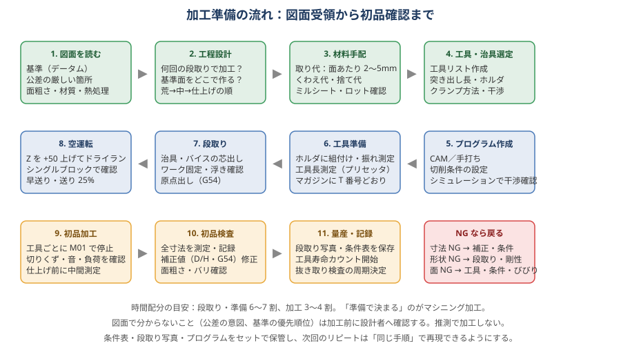
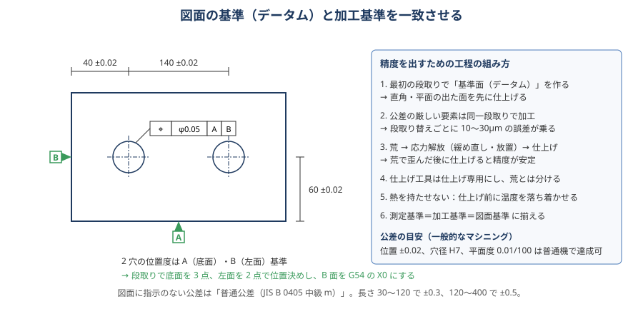

# 00 加工準備の進め方

> **この章のポイント**
> - マシニング加工は「準備で決まる」。図面を読み、工程を設計し、材料・工具・治具を揃え、空運転で確認してから削る。
> - 図面の **基準（データム）** を加工基準・測定基準と一致させると、寸法が安定する。
> - 初品は「工具ごとに止めて確認」。全部削ってから測ると手遅れになる。

## 1. 図面を読む

図面を受け取ったら、いきなり CAM を開かず、次の順に読みます。

| 確認項目 | 見るところ | 加工への影響 |
|---|---|---|
| 材質・熱処理 | 表題欄、注記（S45C 調質、SUS304、A5052 など） | 工具材種・切削条件・取り代・熱処理前後の工程 |
| 基準（データム） | データム記号 A, B, C、寸法の起点 | どの面を最初に仕上げるか、段取りの基準面 |
| 公差の厳しい箇所 | ±0.02 以下、H7 穴、幾何公差（位置度・平行度・直角度） | 同一段取りで加工する要素、仕上げ工程の分離 |
| 面粗さ | ▽記号、Ra 値 | 仕上げ条件、工具（ボール径・ノーズ R）、バリ処理 |
| 形状の難所 | 深いポケット、薄肉、小 R、深穴、片持ち | 工具突き出し、びびり対策、荒→仕上げの取り代 |
| 数量・納期 | 1 個か 1,000 個か | 治具の作り込み、工具寿命管理、段取り時間の許容 |
| 注記 | 「全周 C0.5」「バリなきこと」「指示なき R は R0.5」 | 忘れやすい後工程を最初に洗い出す |

**図面で分からないこと（公差の意図、基準の優先順位、相手部品との関係）は加工前に設計者へ確認します。** 推測で加工して手戻りするより、質問したほうが圧倒的に早いです。

## 2. 工程設計

### 基本の考え方

1. **最初の段取りで基準面を作る**：直角と平面の出た面を先に仕上げ、以後はその面を基準に位置決めする。
2. **公差の厳しい要素は同じ段取りで加工する**：段取り替えごとに 10〜30 µm の誤差が乗ると考える。
3. **荒 → 応力解放 → 仕上げ**：荒加工で内部応力が解放されて歪む。荒の後にクランプを緩めて締め直し、必要なら一晩置いてから仕上げる。
4. **熱処理があるなら前後で工程を分ける**：焼入れ前に荒と下穴、焼入れ後に研削・硬質仕上げ。焼入れ歪みの取り代（0.3〜0.5 mm）を残す。
5. **工具本数と交換回数を減らす**：同じ工具で削れる要素はまとめる。工具交換 1 回 = 数秒〜十数秒＋ばらつきの原因。

### 段取り回数の目安

| 形状 | 段取り数 | 進め方 |
|---|---|---|
| 板物（片面加工） | 1〜2 回 | 表面を加工 → 裏返して裏面とバリ取り |
| 六面体（ブロック） | 2〜3 回 | 6 面出し（基準面作成）→ 上面加工 → 裏面 |
| 箱物・多面 | 2〜4 回 | 横形 MC or 4 軸なら 1〜2 回 |
| 複雑形状（金型・インペラ） | 5 軸なら 1〜2 回 | 荒・中仕上げ・仕上げで工具を分ける |

### 6 面出し（六面体の基準面作り）の標準手順

1. 素材の最も広い面を上にしてバイスにくわえ、上面を軽く削る（面 1）。
2. 面 1 を固定口金側に当てて、隣の面を削る（面 2：面 1 と直角）。
3. 面 2 を下にして面 1 を口金に当て、上面を削る（面 3：面 1 と平行）。この時点で 3 面が直角・平行。
4. 残りの 3 面を、仕上がった面を基準に順に加工する。
5. 直角度は口金の平行と、パラレルへの密着（浮きなし）で決まる。ダイヤルゲージで口金の平行を 0.01/100 以内に出しておく。

## 3. 材料手配

| 項目 | 目安 |
|---|---|
| 取り代（面あたり） | 引抜材・ミガキ材：0.5〜1 mm、黒皮・鋳物：2〜5 mm、溶接構造：3〜5 mm |
| くわえ代 | バイスは 5 mm 以上（薄物でも 3 mm）。深い加工は 10 mm 以上。 |
| 捨て代（タブ・ダボ） | 全周加工する薄物は、下に 3〜5 mm の捨て板を残し最後に切り離す |
| 検査 | ミルシート（材料証明）、ロット、硬さ。材料違いは最も高くつく失敗 |
| 応力 | 圧延材・厚板は歪みやすい。荒取り後の放置、または応力除去焼なましを検討 |

## 4. 工具・治具の選定

工具リストを作ってから CAM に入ります。工具リストは「T 番号・工具名・径・刃長・突き出し長・ホルダ・H/D 番号・用途」を一覧にしたものです。

- 突き出し長は「必要最小＋2〜3 mm」。長いほど剛性が L³ で落ちる（→ [06 加工精度](06-accuracy.md)）。
- 荒用と仕上げ用の工具は分ける。荒で摩耗した工具では面粗さと寸法が出ない。
- クランプ位置と工具経路の干渉を CAM 上で確認する。クランプを避けるために工具を長くするなら、クランプ位置を変えるほうが良い。

詳しくは [03 工具の選び方](03-tools.md)、[05 段取り・治具・クランプ](05-setup-fixture.md) を参照。

## 5. プログラム作成と検証

- CAM のシミュレーションで「削り残し」「食い込み」「ホルダ干渉」を確認する。
- ポストプロセッサから出た G コードは、頭（セーフティライン）と工具交換部を目で確認する。
- 機械側で **ドライラン**（Z を +50 mm 上げる、または送り 25%＋シングルブロック）を行う。

詳しくは [11 プログラム](11-programming.md) を参照。

## 6. 工具準備

1. ホルダとコレットを清掃し、工具を規定トルクで締める。
2. 振れをダイヤルゲージで測る（φ10 以下のエンドミルは 10 µm 以下、仕上げは 5 µm 以下が目安）。
3. 工具長をプリセッタまたは機上ツールセッタで測定し、H 番号に登録する。工具径は D 番号に登録する。
4. マガジンの T 番号と工具リストを照合する（**工具番号 = H 番号 = D 番号** で統一するとミスが減る）。

## 7. 段取り・原点出し

- 治具・バイスをテーブルに固定し、ダイヤルで基準面の平行を出す。
- ワークを固定し、浮きがないことを確認する（パラレルを指で押して動かなければ OK）。
- タッチセンサやピックテスタで X・Y の原点を出し、Z はワーク上面をツールセッタやブロックゲージで合わせる。
- 入力後、G54 で MDI 移動して位置を目視確認する。

## 8. 空運転 → 初品 → 初品検査

| ステップ | 内容 |
|---|---|
| 空運転 | Z を +50 上げた状態、または送りオーバーライド 25% でプログラムを最後まで流す。工具交換位置・退避高さ・干渉を確認。 |
| 初品加工 | 工具ごとに M01 で止めて、切りくず・音・主軸負荷・面を確認。仕上げ前に中間測定して補正。 |
| 初品検査 | 全寸法を測定して記録。D/H 補正値や G54 を修正。面粗さ・バリ・見た目もチェック。 |
| 量産へ | 段取り写真・条件表・補正値・プログラムをセットで保存。工具寿命カウントを開始。抜き取り検査の周期を決める。 |

## 9. 準備の時間配分

- 準備（図面読み・工程設計・CAM・工具・段取り）：6〜7 割
- 加工：3〜4 割

単品加工では準備が加工時間を上回るのが普通です。**準備を削って加工に入ると、手戻りで結局時間がかかります。**

## 10. リピート品を早くするために残すもの

- 工程表（段取りごとの基準面・クランプ方法・原点位置）
- 段取り写真（クランプ位置・治具の向きが分かる角度で）
- 工具リスト（突き出し長・ホルダ込み）
- 切削条件表（実際に使った最終値）
- 補正値（D/H の追い込み量、G54 の値）
- 初品検査記録（どの寸法がどちらに振れやすいか）
- 「次回の改善点」メモ（びびった場所、時間がかかった工程）
