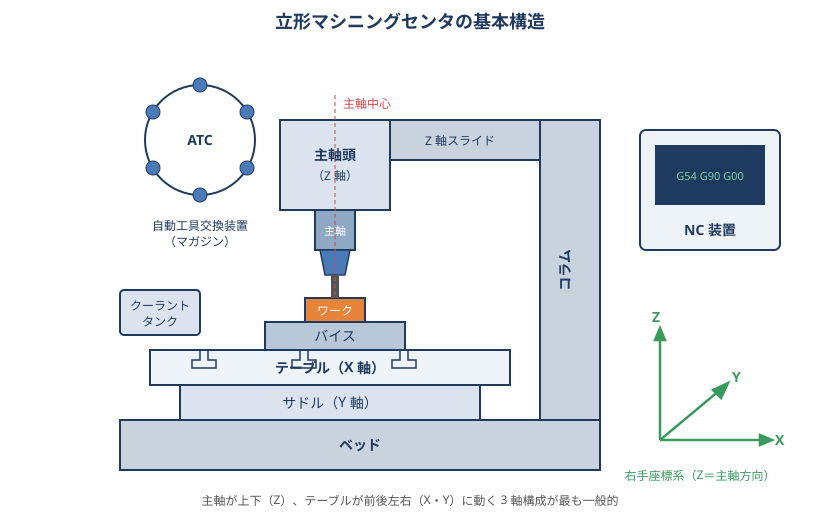
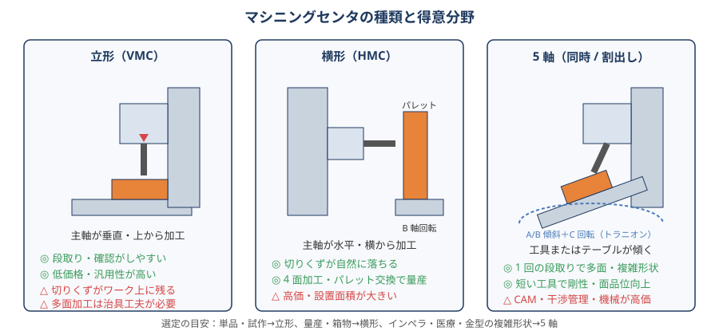

# 01 マシニングセンタの基礎と選び方

> **この章のポイント**
> - マシニングセンタ（MC）は「自動工具交換装置（ATC）を持つ NC フライス盤」。立形・横形・5 軸がある。
> - 機械選びは「加工物の大きさ・形状」「必要精度」「生産量」「工場の床・電源・人」で決まる。カタログの主軸回転数だけで選ばない。
> - 精度は機械の性能だけでなく、据付（水平）・温度環境・保守で大きく変わる。

## 1. 構造と各部の役割

| 部位 | 役割 | 加工への影響 |
|---|---|---|
| ベッド・コラム | 機械の骨格。鋳鉄が主流。 | 剛性・振動減衰性。重い機械ほどびびりに強い |
| テーブル・サドル | ワークを X・Y に動かす | T 溝ピッチ、最大積載質量、移動量（ストローク） |
| 主軸頭・主軸 | 工具を回転させ Z に動かす | 回転数、出力・トルク、テーパ規格、振れ精度、熱変位 |
| 送り駆動 | ボールねじ＋サーボモータ or リニアモータ | 位置決め精度、バックラッシュ、早送り速度 |
| 案内面 | 摺動面（すべり）or 直動ガイド（転がり） | 摺動面：減衰性◎ 重切削向き／直動：高速・低摩擦 |
| ATC | 工具マガジンと交換アーム | 工具本数、交換時間（チップ to チップ）、最大工具径・質量 |
| NC 装置 | プログラムの解釈とサーボ制御 | 先読みブロック数、高精度制御、対話機能 |
| クーラント・切りくず処理 | 切削油の供給と切りくずの排出 | 内部給油（スルースピンドル）圧力、チップコンベア |

## 2. 種類と得意分野

| 種類 | 主軸の向き | 得意 | 注意点 |
|---|---|---|---|
| 立形（VMC） | 垂直 | 板物・単品・試作・金型。段取りと目視確認がしやすく安価 | 切りくずがワーク上に溜まる。多面加工は治具や割出し台が必要 |
| 横形（HMC） | 水平 | 箱物・4 面加工・量産。パレット交換で無人化しやすい | 高価で設置面積が大きい。段取りは治具（イケール・タンブル治具）前提 |
| 5 軸（同時・割出し） | 傾斜・回転軸付き | 複雑形状、多面加工の 1 回段取り、短い工具での高品位加工 | 機械・CAM・干渉管理が高度。回転軸の精度と熱で誤差が出やすい |
| 門形（ダブルコラム） | 垂直 | 大型ワーク・定盤・金型ベース | 床・基礎・クレーンが必要 |
| 小型・高速（BT30 クラス） | 垂直 | アルミ・小物・大量生産。早送り・ATC が速い | 剛性・トルクが小さく鋼の重切削は苦手 |

**選定の目安**：単品・試作 → 立形、量産・箱物 → 横形、インペラ・医療部品・複雑金型 → 5 軸。

## 3. 主軸の見方

### 回転数と出力・トルク

- **回転数（min⁻¹）**：小径工具・アルミ加工では高回転（12,000〜30,000）が効く。鋼の大径カッタでは 8,000 でも十分。
- **出力（kW）**：連続定格と 30 分定格がある。荒加工の除去量は出力で頭打ちになる（→ [付録 A 所要動力](appendix/a-formulas.md)）。
- **トルク（N·m）**：低回転での重切削（大径フェイスミル、大径ドリル、タップ）はトルクが必要。高速主軸ほど低速トルクが小さい傾向。
- **主軸の駆動方式**：ベルト（安価・低速トルク大）、ギア（重切削）、ビルトイン（高速・低振動・熱に注意）。

### 主軸テーパ（工具インターフェース）

| 規格 | 特徴 | 用途 |
|---|---|---|
| BT30 | 小型・高速。ATC が速い | アルミ小物・量産 |
| BT40 | 日本の標準。汎用性が最も高い | 一般加工全般 |
| BT50 | 大径・重切削。トルク伝達に優れる | 鋼・鋳鉄の重切削、大型機 |
| BBT（2 面拘束） | テーパ＋端面拘束で高速時の主軸伸びに強い | 高速・高精度 |
| HSK-A63/A100 | 2 面拘束・中空短テーパ。高速・高剛性・繰り返し精度◎ | 5 軸・高速機・金型 |
| CAPTO | 多角形テーパ。旋盤との共用性 | 複合加工機 |

高速回転時、主軸は遠心力で径が広がりホルダが奥に引き込まれます（BT のみだと Z が数十 µm 変化）。2 面拘束は端面で位置が決まるためこれが起きません。

## 4. 精度仕様の読み方

| 項目 | 意味 | 目安（汎用立形） |
|---|---|---|
| 位置決め精度 | 指令位置と実位置の差（全ストローク） | ±0.005〜0.01 mm |
| 繰り返し位置決め精度 | 同じ位置に何度も戻る再現性 | ±0.002〜0.003 mm |
| 主軸端振れ | テストバー先端の振れ | 0.005 mm 以下（300 mm 先端で 0.01〜0.015） |
| 真直度・直角度 | 各軸の移動の真っ直ぐさ、軸間の直角 | 0.01〜0.02 / 全長 |
| 円弧精度（ボールバー） | 円を描いたときの真円度 | 0.005〜0.01 mm |

カタログ精度は 20 ℃ の恒温室・ウォームアップ後の値です。現場では熱変位・据付・保守状態で数倍悪くなることを前提にします（→ [06 加工精度](06-accuracy.md)、[12 保守](12-maintenance.md)）。

## 5. 機械選定のチェックリスト

### 加工物から決める

- [ ] 最大ワークの寸法＋治具＋工具交換の逃げがストロークに収まるか（X・Y・Z、テーブルから主軸端面までの距離）
- [ ] ワーク＋治具の質量がテーブル積載質量以内か
- [ ] 主な材料（アルミ中心なら高速主軸、鋼中心ならトルク・剛性）
- [ ] 必要精度（H7 穴・位置度 0.02 なら通常機、0.005 以下なら高精度機＋恒温）
- [ ] 必要工具本数（マガジン 20〜30 本が標準、多品種なら 40〜60）
- [ ] 最大工具径・長さ・質量が ATC の制限内か

### 生産形態から決める

- [ ] 単品なら段取り性（立形・対話機能・タッチプローブ）
- [ ] 量産なら自動化（パレットチェンジャ、ロボット、ワーク計測、工具寿命管理）
- [ ] 無人運転するならチップコンベア、ミストコレクタ、工具折損検知、消火設備

### 工場環境から決める

- [ ] 床の耐荷重・基礎（重量 5〜15 t）、搬入経路、天井高さ
- [ ] 電源容量（主軸出力＋周辺機器）、エア（0.5 MPa、必要流量）
- [ ] 温度環境（直射日光・出入口の風・暖房の直風を避ける）
- [ ] 保守サービスの拠点距離、部品供給、操作教育

### オプションの優先度（現場で効くもの）

1. タッチプローブ（ワーク計測）とツールセッタ（工具長・径・折損検知）：段取り時間とミスを大幅に減らす。
2. 主軸スルークーラント：深穴・難削材の寿命と切りくず排出。
3. 熱変位補正・主軸冷却：寸法安定。
4. 高精度・高速加工モード（先読み・ナノスムージング等）：金型・3D 面の品位。
5. チップコンベア・ミストコレクタ：無人化と作業環境。

## 6. 中古機を見るときのポイント

- 主軸を回して異音・振動・発熱を確認。テストバーで振れを測る。
- 各軸のバックラッシュ（ダイヤルで往復させて戻り量）とロストモーション。
- 摺動面・直動ガイドの傷、テレスコカバーの破れ、油漏れ。
- ATC の動作（引っかかり、アーム位置ずれ）。
- 稼働時間（主軸運転時間）、アラーム履歴、保守記録。
- NC のバッテリ、パラメータのバックアップの有無。
