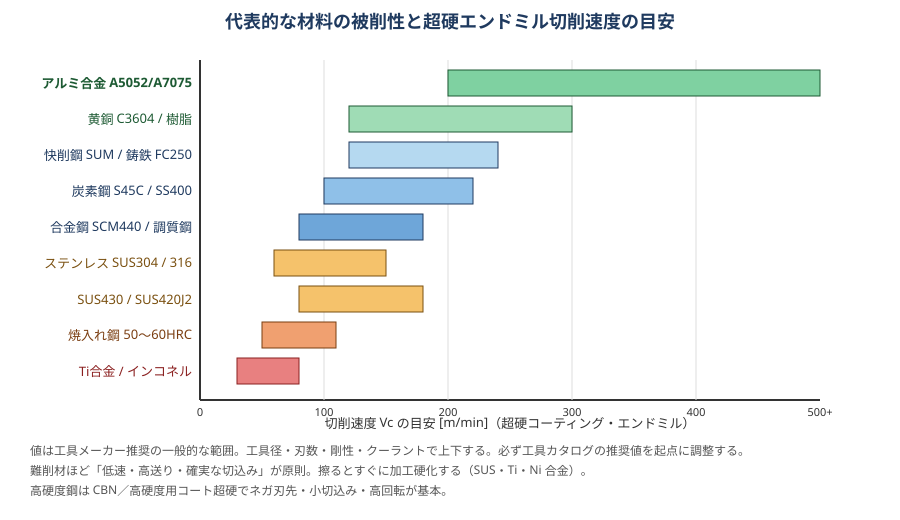

# 02 材料と被削性

> **この章のポイント**
> - 被削性（削りやすさ）は「硬さ」だけでは決まらない。熱伝導率、加工硬化のしやすさ、溶着性、切りくずの切れやすさが効く。
> - 難削材ほど「低速・確実な切込み・鋭い刃」。擦ると加工硬化して悪循環になる。
> - 材料の指定・ロット・熱処理状態を確認してから条件を決める。同じ「SUS」でも 304 と 430 では全く違う。

## 1. 被削性を決める要素

| 要素 | 削りやすい | 削りにくい | 代表例 |
|---|---|---|---|
| 硬さ | 低い（100〜250 HB） | 高い（35 HRC 以上） | 焼入れ鋼 |
| 熱伝導率 | 高い（熱が逃げる） | 低い（刃先に熱が集中） | SUS、Ti、Ni 合金 |
| 加工硬化 | しにくい | しやすい（擦ると硬くなる） | SUS304、インコネル |
| 溶着性 | 低い | 高い（刃先に付く） | アルミ、SUS、低炭素鋼 |
| 切りくずの切れ | 短く切れる | 長く伸びる | 鋳鉄（短い）／SUS（長い） |
| 研磨性（アブレシブ） | 低い | 高い（介在物・硬質粒子） | 鋳物の黒皮、Si の多いアルミ |

## 2. 材料別の特性と加工のコツ

### 炭素鋼・構造用鋼（SS400、S45C、S50C）

- 最も基本的な被削材。超硬コーティング工具で Vc 100〜220 m/min。
- **S45C 調質材（25〜30 HRC）** は生材より切削速度を 20〜30% 落とす。
- SS400 は軟らかく粘い。構成刃先が出やすいので Vc を上げ、すくい角の大きい工具に。
- 黒皮（ミルスケール）は硬くアブレシブ。1 パス目は ap を大きく取って黒皮の下に刃を入れる。

### 合金鋼・工具鋼（SCM440、SKD11、SKD61、NAK80）

- SCM440 調質：S45C より靭性が高く、刃先に負担。TiAlN 系コートで Vc 80〜180。
- SKD11（焼なまし状態 200 HB 前後）：Cr 炭化物でアブレシブ。焼入れ後（58〜62 HRC）は CBN・高硬度用超硬で高速微小切込み。
- NAK80 などプリハードン鋼（40 HRC）：金型で多用。高硬度用コート超硬、ボールエンドミルの高速仕上げが効く。

### ステンレス鋼（SUS304、SUS316、SUS430、SUS420J2、SUS630）

- **SUS304/316（オーステナイト系）** は加工硬化・低熱伝導・溶着の三重苦。
  - Vc 60〜150 m/min、**fz は下げない**（0.05〜0.1 以上）。薄く擦ると硬化層を作る。
  - 鋭いポジ刃先＋靭性の高い母材＋TiAlN／AlCrN コート。
  - クーラントは多めに常時（断続で熱亀裂）。油性・高濃度エマルションが有利。
  - 穴あけはペック回数を減らす（硬化層を何度も切らない）。
- **SUS430（フェライト系）・SUS420J2（マルテンサイト系）** は比較的削りやすい。304 の条件から Vc を 20〜30% 上げられる。
- **SUS630（析出硬化系、H900 で 40 HRC）** は硬く粘い。高硬度用条件＋剛性重視。

### アルミニウム合金（A5052、A6061、A7075、ADC12）

- 高速で削れる（Vc 200〜1,000 m/min 以上）。**主軸回転数の上限が条件を決める**ことが多い。
- 溶着が最大の敵。ノンコート超硬 or DLC コート、鏡面仕上げのすくい面、2〜3 枚刃で切りくずポケットを大きく。
- クーラントは必須（ドライで溶着）。エマルションかミスト。切削油の油性成分が効く。
- **A5052** は粘く、面粗さが出にくい → 高速・小 fz・鋭い刃。**A7075** は硬く切りくずが切れやすく、最も削りやすい部類。
- **ADC12（ダイカスト）** は Si を含みアブレシブ。ダイヤモンド（PCD）工具が寿命に効く。鋳肌の巣に注意。
- 熱膨張が鋼の 2 倍。仕上げ寸法は温度に敏感。測定は温度を落ち着かせて。

### 鋳鉄（FC250、FCD450）

- 切りくずが粉状に切れ、切削抵抗も小さいが、黒鉛と鋳肌がアブレシブ。Vc 100〜250。
- **FC（ねずみ鋳鉄）** はドライ加工が一般的（粉がクーラントに混じり機械を痛める）。集塵する。
- **FCD（ダクタイル）** は粘く鋼に近い。コーティング超硬で FC より Vc を落とす。
- 鋳肌の下に硬い層（チル）や砂の噛み込みがある。1 パス目は深めに。巣（鋳巣）が出たら設計・鋳造側に連絡。

### 銅合金（C3604 快削黄銅、C1100 タフピッチ銅、ベリリウム銅）

- 快削黄銅は最も削りやすい材料の一つ。ノンコートまたは DLC で高速。ドリルの食い込み（引き込まれ）に注意し、すくい角を小さくすると安定。
- 純銅は粘く溶着しやすい。鋭い刃・高速・油性クーラント。バリが出やすい。
- ベリリウム銅は粉じんが有害。集塵とマスク。

### チタン合金（Ti-6Al-4V）

- 低熱伝導・低ヤング率（たわむ）・高温で化学反応。**刃先に熱が集中し、擦るとすぐ摩耗**。
- Vc 40〜80 m/min、fz 0.08〜0.15。**大量のクーラント（できれば高圧スルー）**。
- トロコイド／低 ae・大 ap の高能率加工が最も相性がよい。
- 切りくず・粉は発火の危険。乾燥した細かい切りくずを溜めない。

### ニッケル基耐熱合金（インコネル 718、ハステロイ）

- 加工硬化・高温強度・低熱伝導。**最難削材**。Vc 20〜50（超硬）、セラミックなら 200〜300（専用条件）。
- 剛性最優先。びびると即欠損。ap を毎パス変えてノッチ摩耗を分散。
- 工具は「まだ使える」と思っても早めに交換。境界摩耗が始まると一気に進む。

### 樹脂（POM、MC ナイロン、PEEK、アクリル、ベーク）

- 熱で溶ける・変形する。**高回転・高送り・シャープな刃（ハイス or ノンコート超硬）**で熱を溜めない。
- クランプで変形しやすい。面で受けて軽く締める。真空チャックが理想。
- 吸湿・熱膨張で寸法が変わる。精密公差は加工後の環境で測定。
- 粉じんが出る（ベーク・GFRP）。集塵と工具の耐摩耗（ダイヤ）。

## 3. 材料の状態を確認する

| 確認事項 | 理由 |
|---|---|
| 熱処理状態（生材／調質／焼入れ） | 硬さが 2 倍違えば条件が全く違う |
| 圧延方向・板厚方向 | 歪み、面粗さ、強度の異方性 |
| 引抜材／ミガキ材／黒皮／鋳造 | 取り代と 1 パス目の条件 |
| 硬さ測定（ロックウェル・ブリネル） | 図面指定と現物が合っているか |
| ロット番号・ミルシート | トレーサビリティ。「今日だけ削れない」の原因追跡 |

## 4. 素材の準備と応力

- 圧延材・厚板は内部応力が大きく、荒取り後に歪む。**荒取り → 放置（できれば一晩）または応力除去焼なまし → 仕上げ**。
- 片面だけ大きく削ると反る。表裏を交互に削って応力バランスを取る。
- 薄物は「削れば削るほど反る」。捨て代付きで加工し、最後に切り離す。
- 溶接構造品は溶接部近くが硬く、歪みが大きい。焼なまし指定の有無を確認。

## 5. 材料別 一言メモ（現場の勘どころ）

| 材料 | 一言 |
|---|---|
| SS400 | 粘い。切りくずが伸びる。Vc を上げ、ダウンカットで面を出す |
| S45C | 基本材。ここで条件の基準を作る |
| SCM440 | S45C の 8 割の Vc。刃先強度を優先 |
| SUS304 | 擦らない。fz を落とさない。クーラント常時 |
| SUS303（快削） | 304 より楽。S 添加で工具は少し摩耗しやすい |
| A5052 | 溶着とバリ。高回転・鋭い刃・油性 |
| A7075 | アルミの中で一番削りやすい。寸法は温度に注意 |
| FC250 | ドライ。粉じん集塵。1 パス目は深く |
| C3604 | 引き込まれ注意。すくい角小さめ |
| Ti-6Al-4V | 低速・多量クーラント・低 ae 大 ap |
| インコネル | 剛性・鋭さ・早め交換。びびりは即欠損 |
| POM | 熱を溜めない。締め過ぎない |
