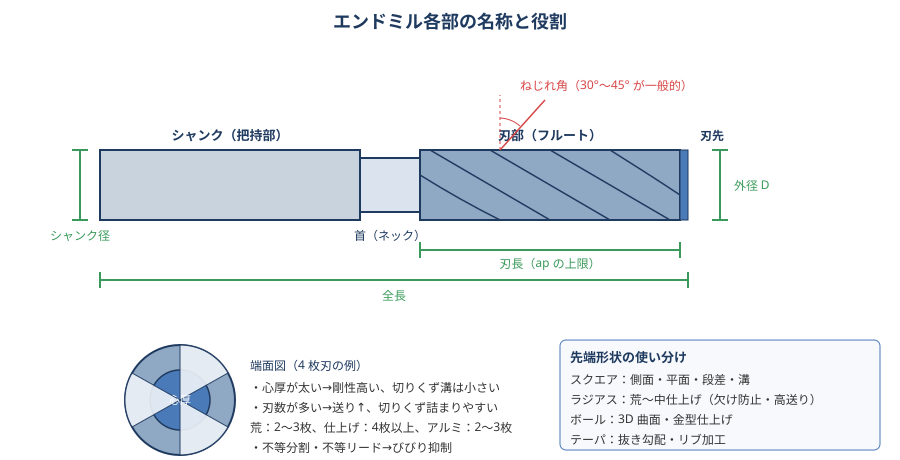
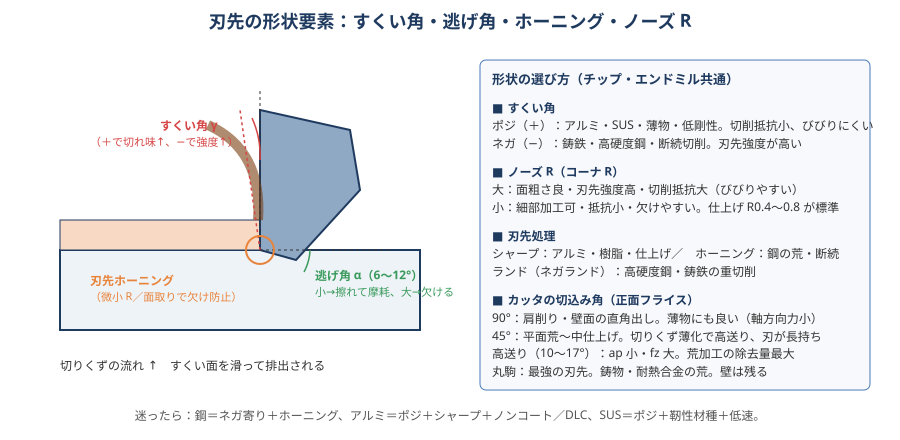
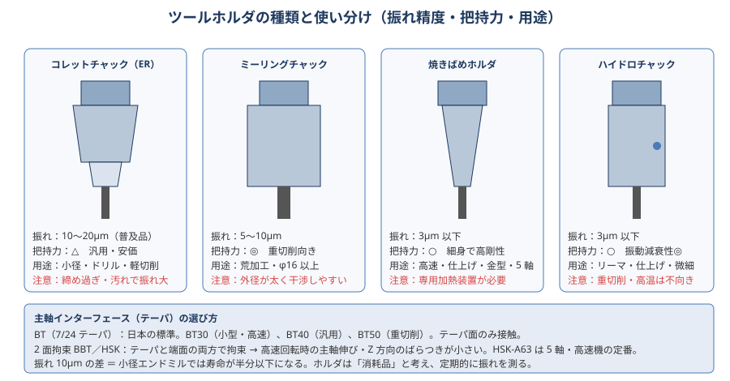

# 03 工具の選び方

> **この章のポイント**
> - 工具選びは「材料 × 加工内容（荒／仕上げ、平面／側面／溝／穴） × 機械の剛性・回転数」で決める。
> - 工具本体より **ホルダと突き出し長** が結果を左右することが多い。振れ 10 µm の差は小径工具の寿命を半分にする。
> - コーティングは万能ではない。アルミにはノンコート／DLC、鋼には TiAlN 系、というように材料で使い分ける。

## 1. 工具の種類と用途

### エンドミル

| 種類 | 用途 | 選定のコツ |
|---|---|---|
| スクエアエンドミル | 側面・平面・段差・溝・ポケット | 最も汎用。刃数は荒 2〜3、仕上げ 4〜6。コーナに小 R（0.2〜0.5）付きは欠けにくい |
| ラジアスエンドミル | 荒〜中仕上げ、隅 R 付き底面 | コーナ R で刃先強度と面が向上。高送り荒加工にも |
| ボールエンドミル | 3D 曲面・金型仕上げ | 中心部は周速ゼロ → 傾斜させるか、ピックフィードを小さく |
| ラフィングエンドミル | 荒加工（切りくずを細かく分断） | 切削抵抗が小さく、大 ap 可。面は粗い |
| 高送りエンドミル（ラジアス大／多刃） | 荒加工、ap 小・fz 大 | 切りくず薄化で fz 0.3〜1.0 mm/刃。剛性低い機械でも除去量が稼げる |
| テーパエンドミル | 抜き勾配、リブ | 角度は図面に合わせる |
| ロングネック／ロングシャンク | 深いポケット・壁 | 首下長 = 加工深さ＋余裕。首径は工具径 −0.5〜1.0 |
| 不等分割・不等リード | びびりやすい加工全般 | 刃の間隔・ねじれ角を変えて共振を避ける。まず試す価値あり |
| 多刃（6〜8 枚以上）仕上げ | 側面仕上げの高送り | ae 小・ap 大の「壁一発仕上げ」で面と寸法が安定 |

**刃数の選び方**

- 少ない（2〜3 枚）：切りくずポケット大 → アルミ、溝加工、荒加工。
- 多い（4 枚以上）：剛性・送り速度↑ → 鋼の側面・仕上げ。切りくず詰まりに注意（溝加工は不向き）。
- アルミの溝：2 枚刃。鋼の側面仕上げ：4〜6 枚刃。高硬度：4〜6 枚。

**ねじれ角**

- 30°：標準。汎用。
- 45°以上（強ねじれ）：切れ味↑、面品位↑、軸方向の引き上げ力も↑（薄物・弱クランプは注意）。
- 小さい（15〜20°）：刃先強度↑、高硬度・断続向き。

### ドリル

| 種類 | 用途 | 目安 |
|---|---|---|
| ハイスドリル（コバルト、TiN） | 一般穴、手直し、低剛性 | Vc 20〜35（鋼）。安価。折れても被害小 |
| 超硬ドリル（ソリッド） | 量産、高精度下穴 | Vc 60〜120（鋼）。位置精度・穴径精度が良い。センタ穴不要（3D 以下） |
| 油穴付き超硬ドリル | 深穴（5D〜30D）、難削材 | 内部給油で切りくず排出。ノンステップで貫ける |
| ヘッド交換式ドリル | φ12〜40 の中〜大径 | 再研磨不要、ボディ再利用 |
| スローアウェイドリル（U ドリル） | φ16 以上、浅穴（2〜4D） | 高送りで早い。穴精度は H12 程度。ワーク側の剛性必要 |
| フラットドリル | 傾斜面・曲面への穴、座ぐり底面の平ら化 | 先端が平ら。切りくず排出は劣る |
| センタドリル／スポットドリル | 位置決め | 超硬ドリルなら不要な場合が多い。角度はドリル先端角より大きく（120° 以上）にすると入口が欠けない |

### 正面フライス・肩削りカッタ（チップ式）

| 切込み角 | 特徴 | 用途 |
|---|---|---|
| 90°（肩削り） | 壁面が直角に立つ。軸方向力が小さく薄物に有利 | 段差・壁・薄板の平面 |
| 45° | 切りくず薄化で高送り可。刃先が長持ち、バリが少ない | 平面の荒〜中仕上げの主力 |
| 高送り（10〜17°） | ap 1〜2 mm、fz 1〜3 mm/刃。除去量最大 | 荒加工、深ポケットの荒 |
| 丸駒（ラウンドインサート） | 最強の刃先。断続・鋳肌・耐熱合金 | 荒加工全般。壁は残る |
| ワイパー刃付き | 面粗さを一段良くする | 平面仕上げ |

**チップの材種とブレーカ**

- 材種：P（鋼）、M（ステンレス）、K（鋳鉄）、N（非鉄）、S（耐熱合金）、H（高硬度）の ISO 分類で選ぶ。番号が小さいほど耐摩耗、大きいほど靭性。
- ブレーカ（切りくず処理形状）：仕上げ用は鋭くて軽切削、荒用は強い。SUS には「鋭くて強い」M 用ブレーカ。

### ねじ・穴仕上げ工具

| 工具 | ポイント |
|---|---|
| タップ（切削） | ハイス・粉末ハイス。通り穴はポイントタップ（切りくず前方排出）、止まり穴はスパイラルタップ（後方排出）。リジッドタップ（G84 同期）＋タップ用油。下穴径は表で確認 |
| 転造タップ（ロールタップ） | 切りくずが出ない。アルミ・銅・SS400 など延性材。下穴径が切削タップより大きい（M6 → φ5.55 前後）。硬い材料・鋳鉄には不可 |
| ヘリカルねじ切り（スレッドミル） | 大径・深い・止まり穴のねじ、難削材。折損のリスクが小さい。プログラム（ヘリカル補間）が必要 |
| リーマ | H7 の穴仕上げ。取り代 0.1〜0.3（径）、低速（Vc 5〜15）・高送り（0.2〜0.5 mm/rev）。下穴の位置精度がそのまま残る |
| ボーリングバー | 位置も径も出せる。φ20 以上の H7〜H6。微調整式で 0.001 mm 単位の追い込み |
| 面取りカッタ | C 面取り。入口のバリと欠け防止、タップ前の面取り。90° が標準 |
| 裏面取り・裏座ぐり | 貫通穴の裏側バリ処理。反転段取りを減らせる |

## 2. 工具材質とコーティング

| 材質 | 特徴 | 用途 |
|---|---|---|
| ハイス（HSS、コバルトハイス、粉末ハイス） | 靭性◎、耐熱△。安価、再研磨可 | タップ、ドリル、低剛性機、断続、手作業 |
| 超硬（WC-Co） | 硬さ・剛性◎（ヤング率はハイスの 3 倍）。靭性△ | エンドミル・ドリルの主力 |
| サーメット（TiCN 系） | 鋼との親和性が低く、仕上げ面が美しい | 鋼の仕上げチップ |
| セラミック | 高温硬さ◎。衝撃・熱衝撃に弱い | 鋳鉄・耐熱合金の高速切削（ドライ） |
| CBN | ダイヤに次ぐ硬さ。鉄と反応しない | 焼入れ鋼（50 HRC 以上）、鋳鉄 |
| PCD（ダイヤモンド） | 最硬。鉄と反応するため非鉄専用 | アルミ（特に高 Si）、銅、樹脂、CFRP |

| コーティング | 特徴 | 相性の良い材料 |
|---|---|---|
| ノンコート（鏡面） | 鋭い刃先、溶着しにくい | アルミ、銅、樹脂 |
| TiN | 汎用、金色。耐熱は低め | ハイス工具全般、低速 |
| TiCN | TiN より硬く摩耗に強い | 鋼・鋳鉄の中速 |
| TiAlN／AlTiN | 高温で酸化アルミ層を作り耐熱◎（800 ℃以上）。現在の主力 | 鋼、SUS、鋳鉄、高硬度鋼、ドライ |
| AlCrN | 耐熱・耐酸化◎、密着性◎ | SUS、耐熱合金、断続、高硬度 |
| DLC | 低摩擦、溶着防止。耐熱は低い | アルミ、銅、樹脂（鉄には不向き） |
| ダイヤモンドコート | 超耐摩耗 | グラファイト、CFRP、高 Si アルミ |

> **アルミに TiAlN は禁物**：Al を含むコーティングはアルミと親和し溶着します。アルミ用はノンコート、DLC、TiB₂ など。

## 3. ツールホルダ

| ホルダ | 振れ精度 | 把持力 | 特徴・用途 |
|---|---|---|---|
| コレットチャック（ER） | 10〜20 µm（精密品 5 µm） | △ | 汎用・安価。小径ドリル・軽切削。締め過ぎ・汚れで振れる |
| ミーリングチャック | 5〜10 µm | ◎ | 荒加工・大径エンドミル（φ16 以上）。外径が太い |
| 焼きばめ | 3 µm 以下 | ○ | 細身で高剛性。高速・仕上げ・金型・5 軸。加熱装置が必要 |
| ハイドロチャック | 3 µm 以下 | ○ | 振動減衰◎。リーマ・仕上げ・微細加工。重切削・高温は不向き |
| サイドロック（ウェルドン） | 10〜20 µm | ◎（抜けない） | 大径・重切削の抜け防止。片側締めで振れが出る |
| アーバ（フェイスミル） | — | — | カッタ用。端面と内径で位置決め。清掃が命 |

**ホルダのルール**

1. 主軸テーパ・ホルダテーパ・コレット内面は挿す前に必ず清掃。切りくず 1 粒で数十 µm 振れる。
2. 振れは工具先端で測る（ホルダだけで測っても意味がない）。φ10 以下は 10 µm 以内、仕上げは 5 µm 以内を目標。
3. 突き出し長は最短に。ホルダの「ゲージライン→工具先端」を工具リストに記録する。
4. コレットは消耗品（締付面が摩耗する）。年に一度は振れを再確認。
5. バランス（G2.5、G6.3）：12,000 min⁻¹ 以上ではバランス調整済みホルダを使う。

## 4. 工具選定の手順（実務）

1. **材料**を確認 → ISO 材種グループ（P/M/K/N/S/H）を決める。
2. **加工内容**（荒／仕上げ、平面／側面／溝／穴／3D）→ 工具タイプを決める。
3. **形状**（最小 R、深さ、幅）→ 工具径・刃長・首下長を決める。最小 R より小さい径の工具は側面仕上げに使わない（コーナで負荷急増）。
4. **機械**（回転数上限・出力・テーパ）→ 径と条件が実現できるか確認。
5. **ホルダ**→ 振れと剛性。突き出し長を最小化。
6. **カタログ推奨条件**を起点に、剛性に応じて 70〜100% から始める。

## 5. 工具コストの考え方

- 工具費は加工コストの 3〜5% 程度。**「安い工具で時間をかける」より「良い工具で速く削る」ほうが総コストは低い**ことが多い。
- ただし、機械や段取りの剛性が低ければ高性能工具の能力は使えない。まず剛性（ホルダ・突き出し・クランプ）を整えてから工具を替える。
- 再研磨：ドリル・エンドミルは 2〜3 回再研磨できる。コーティングの再処理を含めて業者に出す。再研磨品は径が変わるので D 値を測り直す。

## 6. 現場でよくある工具の失敗

| 失敗 | 原因 | 対策 |
|---|---|---|
| 小径エンドミルがすぐ折れる | 振れ大、突き出し長、ae 過大、fz 過小（擦り） | ホルダ変更、突き出し最短、条件見直し |
| アルミで面がむしれる | 溶着（コーティング違い、Vc 低い、ドライ） | ノンコート／DLC、高速、クーラント |
| SUS で工具が急に死ぬ | 加工硬化層を擦った、断続クーラントの熱亀裂 | fz を落とさない、クーラント常時、靭性材種 |
| タップ折損 | 下穴径、切りくず詰まり、同期ずれ、面取りなし | 下穴表、スパイラル／ポイント、リジッド、面取り |
| ボールエンドミルの中心が欠ける | 中心の周速ゼロ、送りで押し込む | 傾斜加工、等高線パス、ランプ進入 |
| チップの逃げ面が急に摩耗 | Vc 過大、カッタの傾き | Vc 10〜20% 下げ、主軸直角度確認 |
