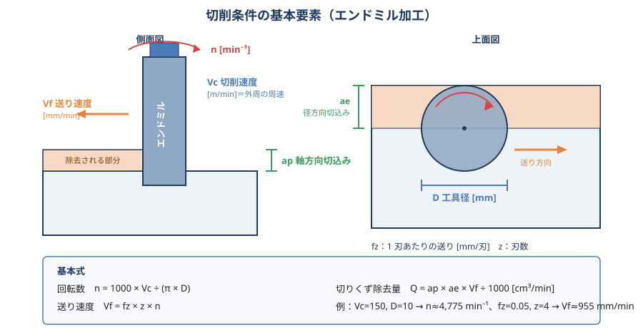
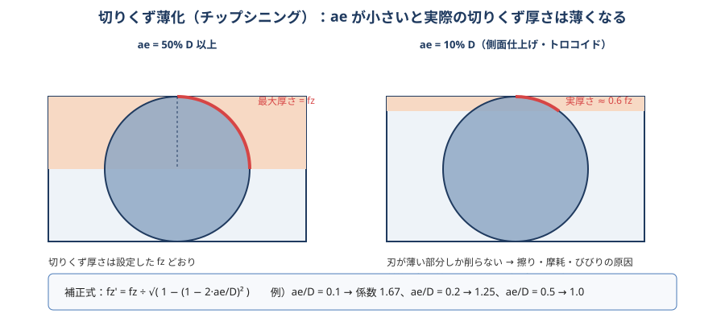
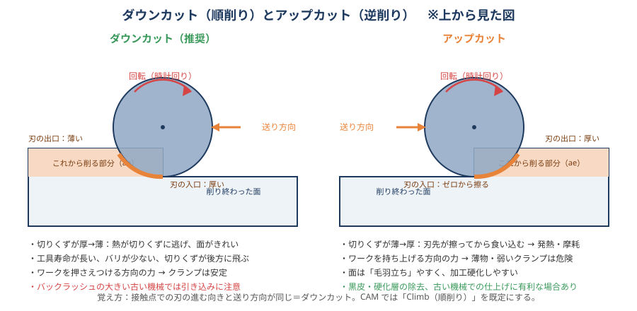

# 04 切削条件

> **この章のポイント**
> - 切削条件は **Vc（切削速度）・fz（1 刃送り）・ap（軸方向切込み）・ae（径方向切込み）** の 4 つ。それぞれが寿命・面・時間に与える影響は違う。
> - 工具寿命に一番効くのは Vc、除去量に一番効くのは fz と ap。「寿命を延ばすなら Vc を下げ、時間を縮めるなら fz を上げる」。
> - ae が小さいときは **切りくず薄化** を補正して fz を上げる。上げないと擦って摩耗する。

## 1. 基本用語と計算式

| 記号 | 名称 | 単位 | 意味 |
|---|---|---|---|
| D | 工具径 | mm | 工具の外径 |
| z | 刃数 | 枚 | |
| Vc | 切削速度 | m/min | 刃先の周速。工具寿命を決める最大要因 |
| n | 主軸回転数 | min⁻¹ | n = 1000 × Vc ÷ (π × D) |
| fz | 1 刃あたり送り | mm/刃 | 切りくずの最大厚さ（ae ≥ D/2 のとき） |
| Vf | 送り速度（テーブル送り） | mm/min | Vf = fz × z × n |
| f | 1 回転送り | mm/rev | f = fz × z（ドリル・リーマはこれで指定） |
| ap | 軸方向切込み | mm | 深さ方向 |
| ae | 径方向切込み | mm | 幅方向（工具径に対する % で表すことが多い） |
| Q | 切りくず除去量 | cm³/min | Q = ap × ae × Vf ÷ 1000 |

**計算例**：φ10 4 枚刃超硬エンドミル、S45C、Vc = 150 m/min、fz = 0.05 mm/刃

- n = 1000 × 150 ÷ (3.14 × 10) ≈ 4,775 min⁻¹ → 4,800 で設定
- Vf = 0.05 × 4 × 4,800 = 960 mm/min
- ap = 10 mm（1D）、ae = 1 mm（10%）なら Q = 10 × 1 × 960 ÷ 1000 = 9.6 cm³/min

## 2. 各条件が結果に与える影響

| 上げると… | 工具寿命 | 面粗さ | 切削抵抗 | 加工時間 | びびり |
|---|---|---|---|---|---|
| Vc ↑ | 大きく短くなる（Taylor） | 良くなる傾向（構成刃先が消える） | やや減る | 短くなる | 共振域に入ることがある |
| fz ↑ | 少し短くなる | 悪くなる（f² に比例） | 増える | 短くなる | 一般に安定側（薄すぎる切りくずはびびりを誘発） |
| ap ↑ | ほぼ変わらない〜少し短く | 影響小 | 比例して増える | 短くなる | 限界を超えると発生（安定限界線図） |
| ae ↑ | 短くなる（熱） | 影響小 | 増える | 短くなる | 発生しやすくなる |

**優先順位の目安**

- 寿命を延ばしたい → Vc を 10〜20% 下げる（fz を下げるのは逆効果になりやすい）。
- 時間を短くしたい → まず fz、次に ap、最後に Vc。
- 面を良くしたい → fz を下げる、ノーズ R／刃数を増やす、Vc を上げる、仕上げ代を均一に。
- びびるなら → [07 びびり・振動](07-chatter.md) の手順（回転数変更・ap 減・突き出し短縮）。

## 3. 材料別 条件の目安（超硬コーティング・エンドミル）

以下はカタログの一般的な範囲です。**実際は工具メーカーの推奨値を起点に、機械剛性に合わせて 70〜100% から始めてください。**

| 材料 | Vc [m/min] | fz [mm/刃] φ10 の場合 | 備考 |
|---|---|---|---|
| アルミ合金 A5052/A6061/A7075 | 200〜600（上限は主軸回転数） | 0.05〜0.15 | ノンコート／DLC、2〜3 枚刃、クーラント必須 |
| 黄銅 C3604 | 150〜400 | 0.05〜0.12 | 引き込まれ注意 |
| 炭素鋼 SS400/S45C（生） | 120〜220 | 0.04〜0.08 | TiAlN 系 |
| S45C 調質／SCM440 | 80〜180 | 0.03〜0.07 | 刃先強度重視 |
| 鋳鉄 FC250 | 100〜250 | 0.05〜0.12 | ドライ可 |
| SUS304/316 | 60〜150 | 0.04〜0.10 | fz を落とさない、クーラント常時 |
| SUS430/420J2 | 80〜180 | 0.04〜0.09 | |
| プリハードン鋼 40 HRC | 60〜150 | 0.02〜0.06 | 高硬度用コート |
| 焼入れ鋼 50〜60 HRC | 40〜120 | 0.01〜0.04 | CBN／高硬度用超硬、小 ap・小 ae |
| Ti-6Al-4V | 40〜80 | 0.06〜0.12 | 多量クーラント、低 ae 大 ap |
| インコネル 718 | 20〜50 | 0.04〜0.08 | 剛性最優先 |
| 樹脂 POM/PEEK | 200〜500 | 0.05〜0.2 | 熱を溜めない |

**fz の径による目安**：fz ≈ D × 0.005〜0.01（φ6 → 0.03〜0.06、φ10 → 0.05〜0.1、φ20 → 0.1〜0.2）。小径ほど比率は小さく。

### ドリル（超硬、鋼）

| 径 | Vc [m/min] | f [mm/rev] |
|---|---|---|
| φ3 | 50〜80 | 0.05〜0.1 |
| φ6 | 60〜100 | 0.1〜0.18 |
| φ10 | 60〜120 | 0.15〜0.25 |
| φ16 | 70〜120 | 0.2〜0.35 |

ハイスドリルは Vc 20〜35、送りは上表の 6〜7 割。アルミは Vc 100〜200。SUS は Vc 40〜70、送りは同等（落とさない）。

### タップ

- Vc：ハイスで鋼 5〜10、アルミ 10〜20、SUS 3〜6 m/min。
- 送りはピッチで決まる（リジッドタップなら F = ピッチ × n）。
- 切削油はタップ専用油またはエマルション高濃度。

### リーマ

- Vc 5〜15 m/min（低速）、f 0.2〜0.5 mm/rev（高送り）、取り代 0.1〜0.3 mm（径）。
- 下穴の位置・真円度がそのまま出る。下穴はエンドミルかボーリングで整える。

## 4. ap と ae の組み合わせ（エンドミル）

| 加工 | ap | ae | 備考 |
|---|---|---|---|
| 溝加工（全幅） | 0.5〜1D（超硬）、0.3〜0.5D（ハイス） | 100% | 切りくず排出が限界。2〜3 枚刃 |
| 側面荒（従来） | 0.5〜1.5D | 30〜50% | |
| 側面荒（トロコイド・高能率） | 2〜3D（刃長いっぱい） | 5〜15% | fz を薄化補正 |
| 側面仕上げ | 刃長いっぱい（壁一発） | 0.1〜0.5 mm | 多刃・高 Vc |
| 平面（フェイスミル） | 0.5〜3 mm | 60〜75% | 100% 幅は避ける（刃の出入りで面が荒れる） |
| 底面仕上げ | 0.1〜0.3 mm | 60〜70% | |
| 3D 仕上げ（ボール） | 0.1〜0.3 mm | ピック 0.1〜0.5 mm | 面粗さで決める |

## 5. 切りくず薄化（チップシニング）

ae が D の 50% 未満だと、刃は円弧の「薄い部分」しか切らないため、実際の切りくず最大厚さは fz より薄くなります。設定 fz のままだと**刃が擦って摩耗し、びびりやすく、加工時間も無駄**になります。

**補正式**：fz' = fz ÷ √(1 − (1 − 2·ae/D)²)

| ae/D | 補正係数 |
|---|---|
| 5% | 2.29 |
| 10% | 1.67 |
| 15% | 1.40 |
| 20% | 1.25 |
| 30% | 1.09 |
| 50% 以上 | 1.00 |

同様に、ボールエンドミルの浅い切込み・高送りカッタ（切込み角が小さい）でも薄化が起きるため、カタログの fz は薄化込みで大きく設定されています。

## 6. ダウンカットとアップカット

- **ダウンカット（順削り、Climb）を基本**にする。切りくずが厚→薄で、熱が切りくずに逃げ、面が良く、寿命が長い。
- アップカットは、黒皮・硬化層のある面の 1 パス目や、バックラッシュの大きい旧型機での仕上げに使うことがある。
- 溝加工では両方が同時に起きる。片側だけ面が荒れるのは正常。

## 7. 条件を決める実務手順

1. 工具カタログの推奨条件（材料 × 工具径）を確認する。
2. 機械・ホルダ・ワーク剛性を見て、Vc は 100%、fz は 70〜80% から始める。
3. 初品で音・切りくず・主軸負荷を確認：
   - 負荷計が定格の 60〜80% で安定 → 良い。
   - 切りくずが青黒い／粉状 → Vc 高い。
   - 切りくずが長くて薄い／擦れる音 → fz 低い。
   - びびり音 → [07 びびり](07-chatter.md)。
4. 工具寿命が目標（例：加工 100 個／1 シフト）に届くよう Vc で調整する。
5. 決まった条件を条件表に記録する。

## 8. 高能率荒加工（トロコイド／HEM）の条件

- ae：5〜15% D、ap：2〜3D（刃長いっぱい）、Vc：従来比 1.2〜1.5 倍、fz：薄化補正込みで従来比 1.5〜2 倍。
- 工具：4〜6 枚刃、不等分割、チップスペースの大きい専用品。
- CAM：Adaptive Clearing／Dynamic Milling／iMachining など「負荷一定」のパスを使う。
- 効果：工具寿命 2〜5 倍、除去量 1.5〜3 倍、小径工具で深いポケットが削れる、機械の負荷が平準化。
- 注意：切りくず排出（エアブロー／クーラント）を確保。回転数と送りが上がるので機械の加減速性能が効く。

## 9. 条件表テンプレート

| T | 工具 | 材質・コート | D | z | ホルダ | 突出し | 用途 | Vc | n | fz | Vf | ap | ae | 備考 |
|---|---|---|---|---|---|---|---|---|---|---|---|---|---|---|
| 1 | φ63 フェイスミル 45° | 超硬 P25 | 63 | 5 | アーバ | 60 | 上面荒 | 180 | 900 | 0.15 | 675 | 2 | 45 | |
| 2 | φ10 スクエア 4 枚 | 超硬 TiAlN | 10 | 4 | 焼きばめ | 35 | 側面荒 | 150 | 4800 | 0.08 | 1536 | 10 | 1.5 | トロコイド |
| 3 | φ10 スクエア 6 枚 | 超硬 TiAlN | 10 | 6 | 焼きばめ | 35 | 側面仕上げ | 180 | 5700 | 0.04 | 1368 | 15 | 0.2 | |
| 4 | φ8.5 超硬ドリル | 超硬 | 8.5 | 2 | コレット | 45 | M10 下穴 | 80 | 3000 | 0.1（f=0.2） | 600 | — | — | G83 Q3 |
| 5 | M10 スパイラルタップ | 粉末 HSS | 10 | — | タッパ | — | ねじ | 8 | 250 | P1.5 | 375 | — | — | G84 |
