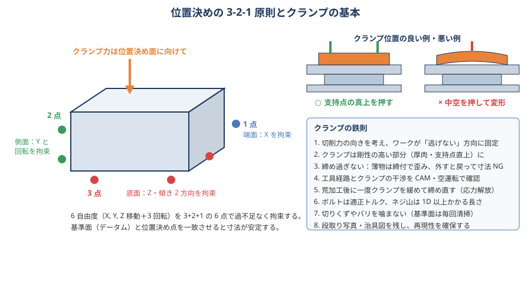
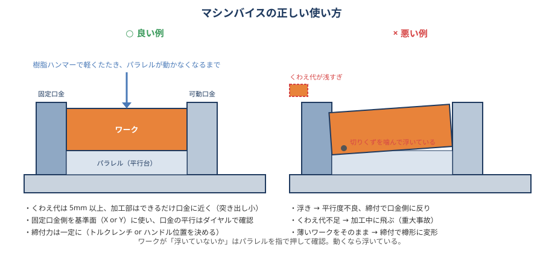
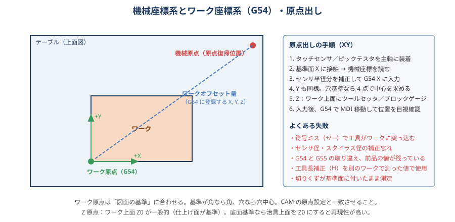

# 05 段取り・治具・クランプ

> **この章のポイント**
> - 位置決め（ワークをどこに置くか）とクランプ（どう押さえるか）は別のもの。**位置決めは 3-2-1、クランプは位置決め面に向けて**。
> - ワークが飛ぶ事故と寸法不良の大半は、クランプの「不足」か「過多（変形）」。
> - 原点出しは「図面の基準」に合わせる。符号ミスと補正忘れが衝突の定番。

## 1. 位置決めの 3-2-1 原則

物体には 6 つの自由度（X・Y・Z の移動と各軸まわりの回転）があります。これを

- **底面 3 点**（Z 移動＋2 つの傾き）
- **側面 2 点**（Y 移動＋Z 軸まわり回転）
- **端面 1 点**（X 移動）

の 6 点で過不足なく拘束するのが 3-2-1 原則です。点を増やしすぎると「どこに当たっているか分からない」状態（過拘束）になり、再現性が落ちます。

**実務でのポイント**

- 底面 3 点は広く配置する（三角形が大きいほど安定）。面で受ける場合も「実際に当たっている 3 点」を意識する。
- 側面 2 点は離す（近いと回転方向が決まらない）。
- 位置決め面は図面のデータムと一致させる。一致させられないときは、その差が誤差になることを承知の上で工程を組む。
- 位置決めピン・当て板は摩耗と切りくず噛みで狂う。定期的に確認。

## 2. クランプの基本

### 鉄則

1. **切削力の向きを考える**：ワークが逃げない方向に固定する。ダウンカットは押さえつける方向、アップカット・強ねじれエンドミル・ドリルの抜け際は持ち上げる方向の力が出る。
2. **位置決め面に向けて締める**：クランプ力で位置決め面に密着させる。
3. **剛性の高い部分を押さえる**：支持点の真上、厚肉部。中空を押すと変形する。
4. **締め過ぎない**：薄物・中空品は締付で歪み、外すと戻って寸法 NG。クランプ力は必要最小限＋安全率。
5. **工具経路と干渉しないか**を CAM と空運転で確認。低いクランプ（ダウンホールド）や横押し（サイドクランプ）を活用。
6. **荒加工後に一度緩めて締め直す**（応力解放で歪んだ分をリセット）。
7. **ボルトは適正トルク**、ねじ山は 1D 以上かかる長さ。M12 で 60〜100 N·m 程度が目安（強度区分と潤滑で変わる。メーカーの締付トルク表を優先）。
8. **基準面は毎回清掃**。切りくず・バリ 1 個で 0.05 mm 傾く。
9. **再現できるように写真・図を残す**。

### クランプ力の目安

切削力の 2〜3 倍以上のクランプ力が必要です。φ10 エンドミルの鋼荒加工で切削力 500〜1,000 N、φ63 フェイスミルの荒で 2,000〜4,000 N 程度。M12 ボルト 1 本の軸力は約 20〜30 kN（適正トルク時）なので、締結自体は十分でも「摩擦で保持している面」の摩擦係数（0.15〜0.3）を掛けると保持力は数 kN。**摩擦に頼らず、切削力を受ける「当て」を設ける**のが基本です。

## 3. マシンバイス

| 項目 | ポイント |
|---|---|
| 据付 | テーブル・バイス底面を清掃 → キーで T 溝に合わせるか、固定口金をダイヤルで平行出し（0.01/100 以内） |
| くわえ代 | 5 mm 以上。深い側面加工は 10 mm 以上。薄物は口金高さより低いパラレルで |
| パラレル | ワーク底面を口金より高く出す。ワークを締めた後、樹脂ハンマーで軽くたたき、**パラレルが指で動かなくなる**まで密着させる |
| 締付力 | 一定にする（トルクレンチ、ハンドル位置を決める、油圧・倍力バイスなら圧力管理）。強すぎると口金側に反る |
| 口金 | 固定口金側を基準面に。可動口金は締付時に上に逃げる構造が多い（引き込み式・角度式は逃げにくい） |
| 変形品 | 黒皮・平行の出ていない素材は、丸棒（ロッド）や球面口金を可動側に入れて当たりを均す |
| 段取り替え | ワーク寸法が変わったら口金のクリアランスとパラレル高さを見直す。ワークが口金の中央に来るように |
| 複数個 | ダブルバイス・マルチバイスで 2〜6 個同時加工。バイス間の高さ差は 0.01 以内に揃える |

**やってはいけないこと**：くわえ代 2〜3 mm で深い側面加工、口金の片側だけでくわえる（偏った締付で口金が傾く）、パラレルを入れずに口金底で受ける（切りくずが溜まる）、ハンマーで強打（バイス・パラレルが傷む）。

## 4. 治具の種類と選び方

| 治具 | 用途 | 特徴 |
|---|---|---|
| バイス | 角物・単品 | 汎用、段取り早い。くわえ面が必要 |
| クランプ（ステップクランプ、ストラップ） | 大物・不定形 | T 溝ボルトで直接押さえる。上面に干渉 |
| 専用治具（据え置き治具） | 量産 | 位置決めピン・受け・クランプを最適化。再現性◎ |
| イケール（アングルプレート） | 横形 MC、側面加工 | 直角面にワークを固定 |
| 割出しテーブル・ロータリ（4 軸） | 多面・円周加工 | 1 段取りで多面。回転中心の芯出しが必要 |
| 真空チャック | 薄板・樹脂・アルミ板 | 変形なく保持。切削力に弱い（横滑り）。貫通加工不可 |
| マグネットチャック | 鉄系の板物 | 段取り最速。薄物は磁力で反る。非磁性材不可。切削力に限界 |
| ゼロポイント（クイックチェンジ）システム | 多品種・段取り替え頻繁 | 数秒で治具交換、繰り返し 5 µm 以下。初期投資大 |
| ダボ・タブ（捨て代） | 全周加工、薄物 | 素材の一部を残して固定し、最後に切り離す |
| 接着・低融点合金・ワックス | 微細・薄肉・異形 | 変形なし。強度は小さい。後処理が必要 |

### 治具設計の考え方（量産治具）

1. **位置決めは 3-2-1**。基準ピン＋ダイヤモンドピン（菱形ピン）で 2 穴基準。
2. **クランプは位置決めに向けて**。油圧・空圧なら力が一定で人によるばらつきがない。
3. **切りくずが溜まらない**構造（受け面を小さく、逃がし・エアブロー）。
4. **工具が届く**：クランプは加工部から離す、低いクランプにする、ホルダ干渉を 3D で確認。
5. **誤挿入防止**：向きを間違えられない形（ポカヨケ）。
6. **摩耗部品は交換式**（受け駒・ピンは焼入れ品、ねじ止め）。
7. **治具自体の精度**：機上で仕上げる（テーブルに載せたまま受け面を削ると平行が出る）。

## 5. 原点出し（ワーク座標系）

### 手順

1. タッチプローブ、またはピックテスタ／芯出しバー（タッチセンサ）を主軸に付ける。
2. 基準面 X に当てて機械座標を読む → センサ半径分を補正して G54 の X に入力。
3. Y も同様。穴基準なら 4 点当てて中心を求める（プローブなら自動）。
4. Z：ワーク上面（または治具上面）にツールセッタ／ブロックゲージ／紙を使って合わせる。
5. 入力後、G54 で MDI（G90 G00 X0 Y0）移動して位置を目視で確認する。**Z は必ず安全高さから**。

### ワーク座標系の使い分け

| 座標系 | 用途 |
|---|---|
| G54〜G59 | 6 個の標準ワーク座標系。複数ワーク・複数段取りに割り当て |
| G54.1 P1〜P48（拡張） | 多数個取り、多面加工 |
| G92 | 現在位置に座標を設定（推奨しない：状態依存で事故の元） |
| G52 | ローカル座標系（一時的なシフト）。使ったら必ず G52 X0 Y0 で戻す |
| G10 L2 | プログラムから座標系を書き込む（治具固定の量産で有効） |

### よくある失敗と対策

| 失敗 | 対策 |
|---|---|
| 符号ミス（+/−） | 入力後に必ず MDI で移動して確認 |
| センサ径の補正忘れ | 手順書に「半径 ○ mm を足す／引く」を明記 |
| 前品の G54 が残っている | 段取り開始時に G54〜G59 をクリアする習慣 |
| G54 と G55 の取り違え | プログラム先頭のコメントに使用座標系を書く |
| 工具長 H の測り違い | ツールセッタで自動測定。手測定なら 2 回測る |
| 基準面に切りくず | 清掃 → エアブロー → 指で触って確認 |
| 治具がテーブルに対して傾いている | 基準面をダイヤルで 0.01/100 以内に |

## 6. 薄物・変形しやすいワークの段取り

- **面で受ける**（真空、マグネット、両面テープ、ワックス）。点で押すと局所変形。
- **締付力を分散**：多点・低トルク。トグルクランプは軽い力で確実。
- **荒加工は捨て代付きで両面を交互に**、仕上げは応力解放後に。
- **切削力を小さく**：鋭い刃、小 ae・小 ap、高 Vc、ダウンカット、軸方向力の小さい 90° カッタ。
- **支え**：薄壁は「削り残しで支える」（隣接壁を先に仕上げない）。等高線で上から順に薄くする。
- **確認**：締めた状態で寸法を測っても意味がない。外してから測る。

## 7. 大物・重量物の段取り

- 20 kg を超えるものはクレーン／リフタ。吊り具の定格・玉掛け資格。
- テーブル積載質量とワークの重心（片寄ると案内面を痛める）。
- ワーク自重のたわみ：3 点で受け、受け位置を図面に記録する（測定時も同じ受け方で）。
- 大きなワークは温度が均一になるまで時間がかかる。搬入後 1 日置くのが理想。

## 8. 段取り時間短縮のアイデア

- 外段取り化：機械が動いている間に次の治具・工具を準備（ゼロポイント、プリセッタ）。
- 標準治具・標準口金の共通化と、段取り手順書（写真付き）。
- タッチプローブで原点出しを自動化（マクロで基準穴・基準面を測る）。
- 工具リストとマガジン配置の固定化（よく使う工具は常駐）。
- 段取り替えの「動作分析」：探す・歩く・待つを減らすだけで 20〜30% 短くなる。
