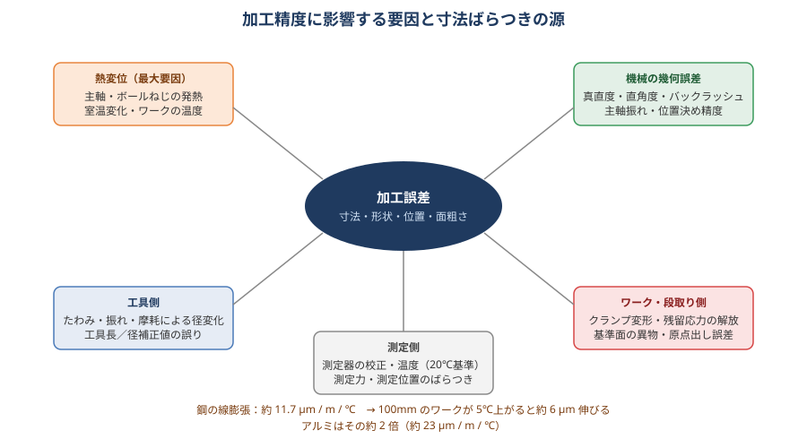
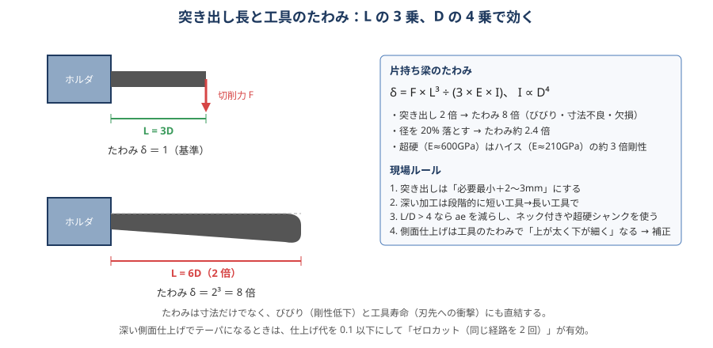

# 06 加工精度・寸法

> **この章のポイント**
> - 加工誤差は「熱変位・機械の幾何誤差・工具のたわみ／振れ／摩耗・段取り・測定」の合計。**最大要因は熱**。
> - 突き出し長を 2 倍にするとたわみは 8 倍。剛性を先に確保し、それでも出ない分を補正で追い込む。
> - 測定の基準・温度・方法を加工と揃えないと、正しく補正できない。

## 1. 誤差の種類

| 種類 | 例 | 主な原因 |
|---|---|---|
| 寸法誤差 | 幅が 0.03 大きい | 工具径補正、工具摩耗、たわみ、熱 |
| 形状誤差 | 平面度、真円度、真直度、テーパ | 機械精度、たわみ、クランプ変形、びびり |
| 位置誤差 | 穴位置、段差の位置 | 原点出し、機械の位置決め精度、熱変位、バックラッシュ |
| 姿勢誤差 | 平行度、直角度 | 段取りの基準面、機械の直角度、主軸の傾き |
| 面粗さ | Ra、Rz | 条件、振れ、びびり、摩耗（→ [10 面粗さ](10-surface-finish.md)） |

## 2. 熱変位

### 発生源

- **主軸の発熱**：ベアリング・モータ。起動から 30〜60 分で Z 方向に 20〜50 µm 伸びることがある。
- **ボールねじの発熱**：高速往復で伸び、位置決め誤差（半閉ループ機で顕著）。
- **室温変化**：朝と昼、扉の開閉、直射日光。機械全体が伸縮・傾く。
- **ワーク・切削熱**：荒加工後のワークは数 ℃〜十数 ℃上がる。アルミは鋼の 2 倍伸びる。
- **クーラント温度**：ワークと機械を温める／冷やす。

### 線膨張の目安

| 材料 | 線膨張係数 [µm/m/℃] | 100 mm が 5 ℃で |
|---|---|---|
| 鋼 | 約 11.7 | 約 6 µm |
| ステンレス SUS304 | 約 17 | 約 9 µm |
| アルミ | 約 23 | 約 12 µm |
| 鋳鉄 | 約 10.5 | 約 5 µm |
| 超硬 | 約 5 | 約 3 µm |

### 対策

1. **暖機運転**：主軸を使用回転数の 50〜100% で 10〜30 分回す。各軸もストロークいっぱい往復（暖機プログラムを作っておく）。
2. **止めない**：昼休みも主軸を低速で回す、または休憩明けに再暖機。
3. **熱変位補正機能**を有効化（主軸・ボールねじの温度センサで補正）。
4. **室温管理**：±1 ℃で精密、±3 ℃で一般。直風・直射日光を避ける。
5. **仕上げ前に温度を落ち着かせる**：荒 → 中仕上げ → （クーラントをかけて放置）→ 仕上げ。
6. **測定は 20 ℃基準**：ワークと測定器を同じ温度に馴染ませる（精密は 2 時間以上）。
7. **仕上げ工程の順番を固定**して熱の入り方を毎回同じにする。再現性が出れば補正で吸収できる。

## 3. 工具のたわみ・振れ

### たわみ

片持ち梁のたわみ δ = F·L³ / (3·E·I)、I ∝ D⁴。

- 突き出し 2 倍 → たわみ 8 倍。
- 径 20% 減 → たわみ約 2.4 倍。
- 超硬はハイスの約 3 倍剛性（E ≈ 600 GPa vs 210 GPa）。

**現れ方**

- 側面仕上げ：上が太く下が細い（テーパ）、工具が逃げて寸法がプラス側。
- 深い壁の底に段差（仕上げパスの継ぎ目）。
- 穴の入口と奥で径が違う（ドリル・ボーリングバーのたわみ）。

**対策**

- 突き出しを最短にする。深い部分だけ長い工具に切り替える。
- ae を小さくして仕上げ代を均一に（中仕上げで 0.1〜0.2 残す）。
- **ゼロカット**（同じ経路をもう一度通す）でたわみ分を除去。
- 超硬シャンク、ネック付き工具、焼きばめホルダで剛性向上。
- CAM のたわみ補正／手動で D 値を側面ごとに調整。

### 振れ

- 工具の振れは「実質的な 1 刃送りの不均一」→ 1 枚の刃だけ摩耗、面粗さ悪化、寸法が振れ分大きく。
- 目標：仕上げ工具 5 µm 以内、荒 10 µm 以内。
- 原因：ホルダ・コレット・主軸テーパの汚れ／傷、コレットの摩耗、工具シャンクの精度、締め方（対角に均等）。

## 4. 機械の幾何誤差

| 誤差 | 現れ方 | 確認方法 |
|---|---|---|
| バックラッシュ・ロストモーション | 円弧の象限に段差、往復で寸法違い | ダイヤルで往復、ボールバー |
| 真直度 | 長物の側面がうねる | 直定規＋ダイヤル、レーザ |
| 直角度（X-Y、X-Z、Y-Z） | 四角が平行四辺形、壁が倒れる | 直角マスタ、ボールバー |
| 主軸の直角度（テーブルに対する） | 平面に「凹み」（カッタが傾いてえぐる）、フェイスミルで片当たり | テストバー先端でテーブルを回して測る |
| 位置決め精度・ピッチ誤差 | 長いピッチの穴位置が徐々にずれる | レーザ測長、ピッチ誤差補正 |
| 回転軸の芯ずれ（4・5 軸） | 割出し後の位置ずれ | 基準球で回転中心を測定・補正 |

半年〜1 年に一度は精度検査し、傾向を記録します（→ [12 保守](12-maintenance.md)）。

## 5. 段取り・ワークに起因する誤差

- クランプ変形：締めた状態で加工した面が、外すと元に戻って狂う（薄物、リング、中空品）。
- 残留応力の解放：荒取りで内部応力が解放され、仕上げ後に時間とともに反る。
- 基準面の異物：切りくず・バリ 1 個で 0.02〜0.05 傾く。
- 基準面の平面度・直角度不良：段取り基準そのものが狂っている。
- 位置決めピンの摩耗、治具の緩み。

## 6. 公差を出すための工程の組み方

1. 最初の段取りで基準面（データム）を作る。
2. 公差の厳しい要素は同一段取り・同一工具で加工する。
3. 荒 → 応力解放 → 仕上げ。仕上げ代は 0.2〜0.5 mm（鋼）、面仕上げは 0.1〜0.3。
4. 仕上げ工具は仕上げ専用。摩耗した工具では寸法が出ない。
5. 仕上げ前にワーク・機械の温度を安定させる。
6. 測定基準 = 加工基準 = 図面基準。

### 公差の目安（一般的な立形 MC、暖機・恒温なし）

| 項目 | 達成しやすい | 工夫すれば | 難しい（研削・恒温・高精度機） |
|---|---|---|---|
| 寸法（100 mm） | ±0.03 | ±0.01 | ±0.005 |
| 穴径 | H8（エンドミル）、H7（リーマ・ボーリング） | H6（ボーリング） | H5 |
| 位置度 | φ0.05 | φ0.02 | φ0.01 |
| 平面度（100 mm） | 0.02 | 0.01 | 0.005 |
| 直角度（100 mm） | 0.02 | 0.01 | 0.005 |

## 7. 補正で追い込む

### 工具径補正（D）

- 側面の仕上がりが 0.02 大きい → D 値を +0.01（半径値）。
- 荒と仕上げで D 番号を分けると、仕上げの追い込みが荒に影響しない。
- **テーパになる場合は補正では直らない**（たわみ・主軸直角度を対策）。

### 工具長補正（H）

- 底面・段差の深さ。ツールセッタで自動測定なら再現性 ±0.005。
- 熱で主軸が伸びると Z がマイナスに（深く）。暖機と熱変位補正。

### ワーク座標系（G54）

- 位置のずれ（全穴が同じ方向に 0.02 ずれ）は G54 で修正。
- 特定の穴だけずれるなら、その穴のプログラム・工具（ドリルの逃げ）を疑う。

### 補正量の記録

補正した値は「なぜ・いくつ」を条件表に残す。次回のリピートで同じ補正を入れれば初品から出る。

## 8. 測定の基本

| 測定器 | 精度の目安 | 注意 |
|---|---|---|
| ノギス | ±0.02〜0.05 | 目安。公差 ±0.05 以下は使わない |
| マイクロメータ | ±0.002〜0.005 | 測定力一定（ラチェット）、温度 |
| ダイヤルゲージ／てこ式 | 0.001〜0.01 目盛 | 比較測定。ブロックゲージで原器と比較 |
| シリンダゲージ／ボアゲージ | ±0.005 | 穴径。リングゲージで原点合わせ |
| 限界ゲージ（栓・ねじ） | 合否判定 | 摩耗確認 |
| ハイトゲージ＋定盤 | ±0.01〜0.02 | 定盤の清掃・平面度 |
| 三次元測定機（CMM） | ±0.002〜0.005 | 温度・プログラム・測定点数 |
| 表面粗さ計 | | 測定方向（送りマークに直角）、カットオフ |
| 機上計測（タッチプローブ） | ±0.005 | 機械の精度に依存。傾向管理に有効 |

**測定の鉄則**

- ワークと測定器を同じ温度に（20 ℃基準）。加工直後の熱いワークで合否判定しない。
- 測定位置・方向を決めて毎回同じに（記録に残す）。
- ゼロ点（原器・ブロックゲージ）を毎回確認。
- 公差の 1/5〜1/10 の分解能を持つ測定器を使う。
- クランプしたまま測らない（薄物・変形品）。

## 9. 精度不良の切り分けフロー

1. **全体が同じ方向にずれる** → 原点（G54）、工具長（H）、熱変位。
2. **寸法が全体に大きい／小さい** → 工具径（D）、工具摩耗、たわみ。
3. **上下でテーパ** → たわみ、主軸直角度、クランプ変形。
4. **場所によってばらつく** → 機械の幾何誤差、段取りの傾き、測定のばらつき。
5. **時間とともに変わる** → 熱変位、工具摩耗、残留応力。
6. **ロットで違う** → 材料（硬さ・寸法）、季節（温度）、工具ロット。
7. **1 個だけ違う** → 切りくず噛み、締付ミス、素材寸法。
