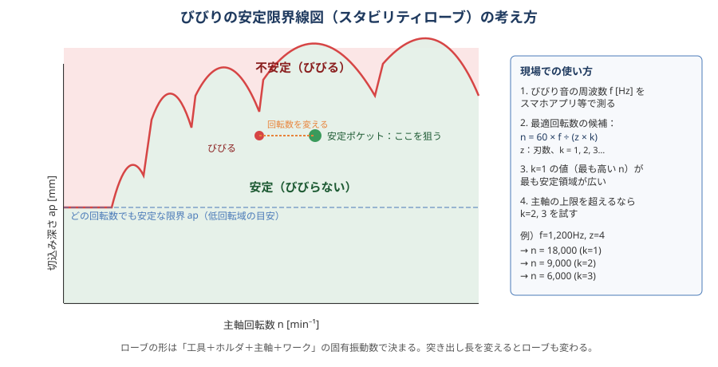

# 07 びびり・振動

> **この章のポイント**
> - びびりには「強制振動」と「自励振動（再生びびり）」がある。対策が違うので、まず見分ける。
> - 自励びびりは **回転数を変える** だけで消えることが多い（安定限界線図）。
> - 根本対策は剛性：突き出し短縮、ホルダ、クランプ、ワーク支持。条件を落とすのは最後。

## 1. びびりの種類と見分け方

| 種類 | 原因 | 特徴 | 対策の方向 |
|---|---|---|---|
| 強制振動 | 刃の出入り、振れ、アンバランス、断続、機械の他の振動源 | 周波数が回転数×刃数の整数倍。回転数を変えると周波数も変わる。徐々に成長しない | 振れ・バランス修正、刃数・回転数変更、断続の緩和 |
| 自励振動（再生びびり） | 前の刃が残した波を次の刃が切ることで振動が増幅 | 大きな音（キーン、ギャー）、面に規則的な模様。切込みを増やすと突然発生。周波数はほぼ一定（系の固有振動数） | 回転数を安定ポケットに、ap 減、剛性・減衰向上、不等分割工具 |
| モードカップリング | 2 方向の振動が連成 | 細長い工具・ボーリングバーで発生 | 剛性・減衰 |

**簡易判別**：回転数を 10〜15% 変える → 音の高さが変わらず消えたり出たりする → 自励振動。音の高さも一緒に変わる → 強制振動。

## 2. 安定限界線図（スタビリティローブ）

- 横軸：主軸回転数、縦軸：切込み深さ ap。曲線の下は安定、上はびびる。
- 曲線は「ローブ（山）」を持ち、**特定の回転数では大きな ap でも安定**（安定ポケット）。
- 低回転域では曲線が平らになり、どの回転数でも安定な最低 ap がある（減衰で決まる）。
- ローブの形は「工具＋ホルダ＋主軸＋ワーク＋治具」の固有振動数で決まる。突き出しを変えれば全部変わる。

### 現場での使い方

1. びびり音の周波数 f [Hz] を測る（スマホの周波数アナライザアプリ、加速度計）。
2. 最適回転数の候補：**n = 60 × f ÷ (z × k)**　（z：刃数、k = 1, 2, 3…）
3. k = 1（最も高い回転数）が最も安定領域が広い。主軸上限を超えるなら k = 2, 3。
4. 候補の回転数で試し、送りは fz を保つように Vf も変更する。

**例**：f = 1,200 Hz、4 枚刃 → n = 18,000（k=1）、9,000（k=2）、6,000（k=3）。主軸が 12,000 までなら 9,000 を試す。

タップテスト（ハンマリング試験）で伝達関数を測り、CAM やソフトでローブを計算する方法もあります。専門設備がなくても、上の手順で 8 割は解決します。

## 3. びびり対策の手順（現場向け）

### ステップ 1：まず確認

- [ ] 工具の振れ（10 µm 以下か）
- [ ] 突き出し長（必要最小か）
- [ ] ホルダの種類（コレットなら焼きばめ／ミーリングチャックへ）
- [ ] クランプの緩み、ワークの浮き、治具のガタ
- [ ] 工具摩耗（摩耗した刃は擦って振動する）
- [ ] 主軸のガタ・異音、ATC のクランプ力

### ステップ 2：回転数を変える

- 10〜15% 上下に振ってみる。消えたらその付近を探る。
- 上の式で候補を計算し、試す。
- **主軸回転数のオーバーライドで試せる**（送りオーバーライドも合わせて fz を維持）。

### ステップ 3：切りくず厚さを確保する

- fz が薄すぎると擦って自励振動を誘発。fz を上げる（薄化補正）。
- ae が小さいなら fz を補正して上げる。

### ステップ 4：切込みを見直す

- ap を減らす（安定限界以下に）。ae を減らす（トロコイド）。
- 荒加工なら「ap 小・fz 大」の高送り工具に切り替える。

### ステップ 5：工具を変える

- 不等分割・不等リード（ばらついた刃ピッチで再生効果を弱める）。
- 刃数を変える（多刃で fz 一定なら負荷が平均化。ただし切りくず排出）。
- ねじれ角を変える（強ねじれで切れ味↑、軸方向力↑）。
- ポジすくい角・鋭い刃・ホーニング小で切削抵抗を下げる。
- ボールエンドミル → 傾斜させる／ラジアスに変更。
- ボーリングバー → 超硬シャンク、防振バー（内部ダンパ付き）。

### ステップ 6：剛性・減衰を上げる

- ワーク：支持を増やす（ジャッキ、当て板、薄壁の裏に樹脂・ワックス・砂袋）。
- 治具：厚く・低く。ワークに近い位置で押さえる。
- 機械：レベル確認、ベースのボルト、摺動面のガタ。
- 減衰：ハイドロチャック、防振ホルダ。

### ステップ 7：加工方法を変える

- ダウンカット → アップカット（またはその逆）を試す。
- 進入方法（ランプ・ヘリカル）、コーナ R を大きく取る（負荷急増を避ける）。
- 薄壁は「削り残しで支えながら」上から等高線で仕上げる。
- 5 軸なら工具を傾けて短い工具で。

## 4. 加工の種類別のびびり

| 加工 | 起きやすい状況 | 効く対策 |
|---|---|---|
| フェイスミル平面 | 大径・多刃・薄物・機械剛性不足 | 刃数を減らす（粗ピッチ）、ae 60〜75%、45° カッタ、ワーク支持 |
| 側面（壁） | 長い工具・深い壁 | 壁一発仕上げ（多刃・ae 小）、ゼロカット、不等分割 |
| ポケット荒 | コーナで ae 急増 | トロコイド／負荷一定パス、コーナ R 大 |
| 溝 | 全幅切削 | ap 小、2〜3 枚刃、fz 確保 |
| 穴（ボーリング） | L/D > 4 | 防振バー、Vc↓、ノーズ R 小、ポジ刃 |
| 薄壁 | 壁厚 < 2 mm、高さ/厚さ > 10 | 削り残し支持、上から順、ワックス・樹脂で裏打ち |
| 3D ボール | 中心付近の低周速、深い突き出し | 傾斜、テーパネック、高精度モード |

## 5. びびりの痕跡から読む

- **面に規則的な縞（模様）**：自励びびり。ピッチから周波数を推定できる（ピッチ = Vf / (60 × f)）。
- **1 刃おきの深い傷**：振れによる強制振動。
- **コーナ部だけびびる**：負荷急増（ae 増）。パスの問題。
- **深さが増えると出る**：突き出し・壁の剛性。
- **工具交換直後は出ないが後で出る**：摩耗。

## 6. びびりを起こさないための設計・準備

- 突き出しは工程設計の段階で最短に。深い形状は段階的に工具を変える。
- ホルダの選定を工具リストに含める（仕上げは焼きばめ／ハイドロ）。
- 荒加工は「負荷一定」の CAM パスを標準にする。
- 治具は低く厚く、クランプは加工点の近くに。
- 機械の主軸回転数の「得意な帯」を工具ごとに記録しておく（ローブの実測データベース）。
