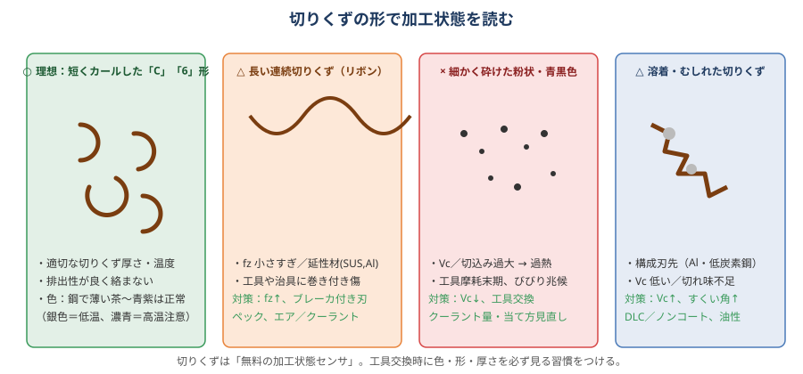

# 08 切りくず・切削油

> **この章のポイント**
> - 切りくずは「無料の加工状態センサ」。色・形・厚さで条件の良し悪しが分かる。
> - 切りくず排出の失敗（詰まり・噛み込み・巻き付き）は、工具折損・面傷・寸法不良の直接原因。
> - 切削油（クーラント）は種類・濃度・供給方法・管理の 4 つで効果が決まる。「かかっていればいい」ではない。

## 1. 切りくずを読む

| 切りくずの状態 | 意味 | 対処 |
|---|---|---|
| 短くカールした「C」「6」形、厚さが均一 | 理想。条件が合っている | そのまま |
| 長いリボン状（延びる） | fz が小さい、延性材 | fz を上げる、ブレーカ付き刃、ペック、エア／クーラント |
| 粉状・細かく砕ける（鋼で） | Vc・切込み過大で過熱、工具摩耗末期 | Vc を下げる、工具交換 |
| 溶着・むしれ、ちぎれた形 | 構成刃先、Vc 低い、切れ味不足 | Vc↑、すくい角↑、コーティング変更、油性クーラント |
| 厚さが不均一（1 枚ごとに違う） | 工具の振れ | 振れ修正 |
| 片側だけ厚い | 主軸の傾き、カッタの片当たり | 主軸直角度、ワーク段取り |

### 色（鋼の場合）

| 色 | 状態 |
|---|---|
| 銀色 | 温度低い。条件に余裕あり（Vc を上げられる） |
| 薄い茶〜黄 | 適正（超硬・ドライ〜ミスト） |
| 青紫 | やや高温。超硬なら許容範囲。ハイスは危険 |
| 濃青〜黒 | 過熱。Vc を下げる、クーラントを見直す。工具寿命が急激に落ちる |

アルミは色が変わらないので形と溶着で判断。SUS は黄〜青で判断（青は硬化層生成の兆候）。

## 2. 切りくず排出の対策

### 詰まり・噛み込み

- **溝・ポケット**：刃数を減らす（2〜3 枚）、ap を減らして切りくずを小さく、エアブロー／クーラントの当て方を切りくずの逃げ方向に。
- **深穴**：ペック（G83）、油穴付きドリル＋内部給油、切りくずが「短く切れる」送り（速すぎると詰まり、遅すぎると伸びる）。
- **ポケットの中の再切削**：溜まった切りくずを再び削ると刃が欠け、面に傷。クーラントの流量、ノズルの向き、横形機への転換。
- **ワーク上の堆積**：立形では常に溜まる。工具交換のタイミングでエアブロー、クーラントのノズルを追加、切りくず除去のプログラムストップ（M00）。

### 巻き付き

- 長い切りくずが工具・ホルダ・治具に巻き付く：fz↑、断続的な切込み（ペック・往復）、ブレーカ付きインサート。
- タップに巻き付く：ポイントタップ（前方排出）／スパイラル（後方）を穴の種類で使い分け、切りくずを分断する送り。

### 飛散・傷

- 切りくずがワークの仕上げ面を叩いて傷 → クーラントの向き、仕上げ加工を最後に、仕上げ面をカバー。
- 長い切りくずがカバー・ドアの隙間から飛ぶ → ドアを閉める、カバー修理。

## 3. 切削油（クーラント）の役割

| 役割 | 効果 | 効く場面 |
|---|---|---|
| 冷却 | 刃先・ワークの温度低下、寸法安定、熱変位抑制 | 高速・難削材・精密 |
| 潤滑 | 摩擦低減、構成刃先防止、面粗さ向上 | 低速・アルミ・タップ・リーマ |
| 切りくず排出 | 流す・砕く | 深穴・ポケット・溝 |
| 防錆 | ワーク・機械の錆防止 | 水溶性の必須機能 |

## 4. 切削油の種類

| 種類 | 特徴 | 用途 |
|---|---|---|
| 水溶性（エマルション、A1 種） | 油を水に乳化。冷却◎、潤滑○。白濁。最も一般的 | 汎用。鋼・アルミ・SUS |
| 水溶性（ソリュブル、A2 種） | 半透明。冷却◎、潤滑△。腐敗しにくい | 高速・軽切削 |
| 水溶性（シンセティック、A3 種） | 透明。冷却◎、潤滑△。清浄性◎ | 研削、視認性重視 |
| 不水溶性（油性） | 潤滑◎、冷却△。引火に注意、ミスト・油煙 | タップ、リーマ、ブローチ、難削材の低速、精密仕上げ |
| ミスト（MQL、セミドライ） | 微量の油をエアで供給。廃液なし、乾いた切りくず | アルミ、鋳鉄、環境対応 |
| ドライ | 油なし。エアブローで排出 | 鋳鉄、高硬度鋼（CBN）、グラファイト、セラミック工具 |
| 高圧クーラント（7〜20 MPa 以上） | 切りくずを砕き、刃先に確実に届く | 深穴、SUS・Ti・Ni 合金、溝、ボーリング |
| スルースピンドル（内部給油） | 工具中心から供給 | 油穴付きドリル、深穴、ポケット |

### 材料別の選び方

- **鋼**：エマルション 5〜8%。高硬度・高速はドライ／エアも可（TiAlN は高温で酸化膜を作るため、ドライのほうが寿命が伸びることも）。
- **アルミ**：エマルション（油性成分の多いもの）6〜10%、または油性。溶着防止が最優先。
- **SUS・Ti・Ni**：高濃度エマルション（8〜12%）か油性。**常時・多量**（断続すると熱亀裂）。高圧が理想。
- **鋳鉄**：ドライ＋集塵が基本。使うなら濃度低めのソリュブル。
- **銅・黄銅**：エマルション（銅に変色を起こさないタイプ）。
- **タップ・リーマ**：専用油、または高濃度エマルション。

## 5. クーラントの管理

### 濃度

- 屈折計（糖度計）で週 1 回以上測定。メーカー指定の係数を掛ける。
- 低い → 潤滑・防錆不足、腐敗しやすい。高い → コスト、皮膚炎、泡、残渣。
- 補充は「原液を薄めて」から。水だけ足すと濃度が下がる。

### pH と腐敗

- pH 8.5〜9.5 が正常。8.0 を下回ると腐敗が進む（臭い、月曜の朝の悪臭）。
- **浮上油（摺動面油・作動油の混入）が腐敗の主因**：油膜が酸素を遮断し嫌気性菌が増える。オイルスキマーで除去。
- 週末はエアレーション（ポンプ循環）で酸素を送る。
- 殺菌剤は応急処置。根本は浮上油除去と濃度管理。

### 交換と清掃

- 全交換は 3〜6 か月（管理が良ければ 1 年）。タンク内のスラッジ・切りくず・バクテリアの膜を清掃してから新液。
- 切りくずをタンクに溜めない（チップコンベア、フィルタ、マグネットセパレータ）。
- 廃液は産業廃棄物。産廃業者へ。

### 水質

- 硬水（Ca・Mg が多い）は乳化を壊し、白い残渣・錆の原因。軟水器・純水を検討。

## 6. 供給方法のコツ

- **ノズルは刃先に当てる**：主軸の回転で霧散するので、切削点の「進行方向前方」から、複数のノズルで。
- **量より確実性**：少量でも常時刃先に当たるほうが、大量でも間欠より良い。
- **深いポケット**：外部からは届かない。スルースピンドル、高圧、または刃長を短くして段階加工。
- **エアブロー**：切りくずを飛ばすだけなら有効。冷却効果は小さく、ミストと組み合わせる。
- **ドライ加工の切りくず**：熱を持って飛ぶ。作業者・カバーの保護、火災注意（Mg・Ti・Al 微粉）。

## 7. 作業者の健康・環境

- クーラントによる皮膚炎（濃度過多、腐敗液、金属イオン）。保護クリーム、手洗い、手袋（停止中のみ）。
- ミストの吸入。ミストコレクタ、換気。
- 油性クーラントの引火（引火点 70〜100 ℃以上のものを選ぶ）。火花の出る材料（Mg、Ti）では水溶性かドライ。
- 廃液・スラッジ・使用済み切りくずの分別（材料ごとに分けると売却価値が上がる）。

## 8. トラブル早見

| 症状 | 原因 | 対策 |
|---|---|---|
| 工具寿命が急に短くなった | 濃度低下、腐敗、ノズルずれ、断続供給 | 濃度・pH 測定、ノズル確認 |
| ワークが錆びる | 濃度低下、pH 低下、硬水、放置 | 濃度・pH 修正、防錆剤、加工後の防錆油 |
| 泡が多い | 濃度高い、軟水すぎ、高圧ポンプ、汚染 | 消泡剤、濃度調整、水質 |
| 悪臭 | 腐敗（浮上油、放置） | 浮上油除去、殺菌剤、全交換 |
| 白い残渣・ベタつき | 硬水、濃度高い、蒸発 | 水質、濃度 |
| 皮膚炎 | 濃度高い、腐敗、金属イオン（Co、Ni） | 濃度、交換、保護 |
| 機械の塗装が剥がれる | pH 高すぎ、相性 | メーカー確認 |
