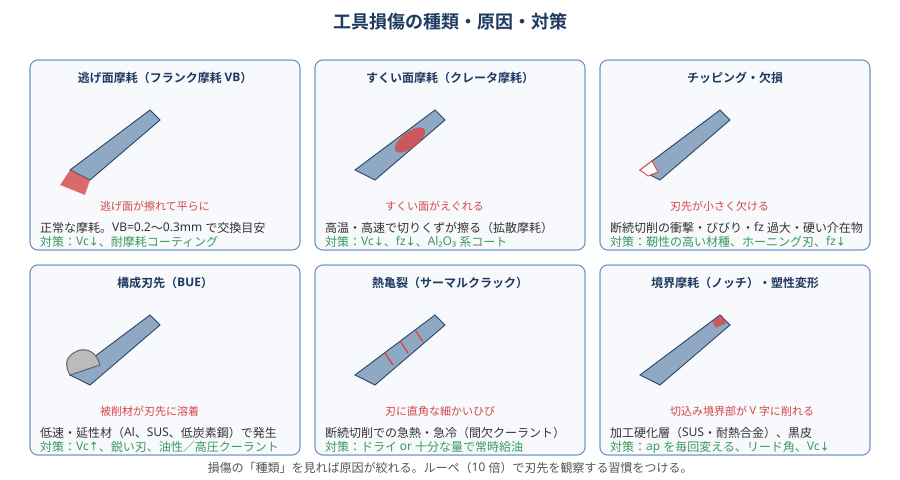
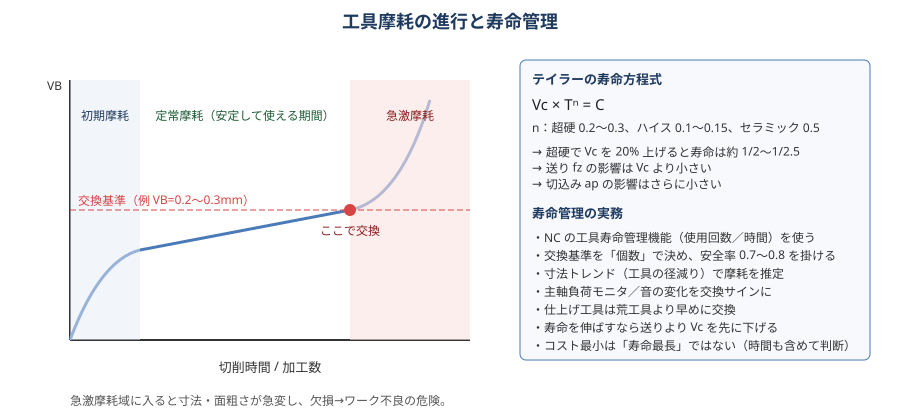

# 09 工具摩耗・寿命

> **この章のポイント**
> - 摩耗の「種類」を見れば原因が分かる。ルーペ（10 倍）で刃先を観察する習慣をつける。
> - 寿命に最も効くのは Vc。**寿命を延ばすなら fz より先に Vc を下げる**。
> - 寿命は「限界まで使う」のではなく「安定域で交換する」。急激摩耗域に入ると寸法・面・欠損で被害が大きい。

## 1. 損傷の種類と原因

| 損傷 | 見た目 | 主な原因 | 対策 |
|---|---|---|---|
| 逃げ面摩耗（フランク摩耗 VB） | 逃げ面が帯状に平らに擦れる | 正常な摩耗。Vc 高い、アブレシブ材 | VB 0.2〜0.3 mm で交換。Vc↓、耐摩耗コート |
| すくい面摩耗（クレータ） | すくい面がえぐれる | 高温・高速で切りくずが擦る（拡散摩耗） | Vc↓、fz↓、Al₂O₃ 系コート、クーラント |
| チッピング（微小欠け） | 刃先が小さく欠ける | 断続の衝撃、びびり、fz 過大、硬い介在物、振れ | 靭性材種、ホーニング刃、fz↓、振れ修正 |
| 欠損・折損 | 大きく割れる、折れる | 過負荷、噛み込み、衝突、摩耗の放置 | 条件見直し、寿命管理、切りくず排出 |
| 構成刃先（BUE） | 刃先に被削材が溶着 | 低速、延性材、切れ味不足 | Vc↑、鋭い刃、油性／高圧クーラント、コート変更 |
| 熱亀裂（サーマルクラック） | 刃に直角な細かいひび | 断続切削の急熱急冷、間欠クーラント | ドライ or 十分な量で常時、耐熱衝撃材種 |
| 境界摩耗（ノッチ） | 切込み境界が V 字に削れる | 加工硬化層（SUS・耐熱合金）、黒皮、バリ | ap を毎パス変える、リード角、Vc↓ |
| 塑性変形 | 刃先がだれる | 高温・高負荷（ハイスで顕著） | Vc↓、fz↓、耐熱材種、クーラント |
| 剥離（コーティング剥がれ） | コートがめくれる | 密着不良、熱衝撃、溶着の脱落 | 材種変更、条件 |

## 2. 摩耗の進行と交換基準

摩耗は「初期摩耗（急）→ 定常摩耗（緩やか）→ 急激摩耗」の 3 段階。**定常摩耗の終わり（急激摩耗に入る前）で交換**します。

### 交換基準の目安

| 用途 | VB（逃げ面摩耗幅） | その他の基準 |
|---|---|---|
| 荒加工 | 0.3〜0.5 mm | 主軸負荷 20〜30% 増、音、切りくず色 |
| 中仕上げ | 0.2〜0.3 mm | 寸法トレンド |
| 仕上げ | 0.1〜0.2 mm | 面粗さ、寸法、バリ |
| 小径工具（φ3 以下） | 0.05〜0.1 mm | 折損前に交換 |
| ドリル | 外周コーナ摩耗 0.2〜0.3、穴径・バリ | 抜け際のバリ増大、音 |
| タップ | ねじゲージ通り側が入りにくい、トルク増 | 折損前 |

## 3. テイラーの寿命方程式

**Vc × Tⁿ = C**（T：寿命 [min]、n・C：工具と材料で決まる定数）

| 工具材質 | n |
|---|---|
| ハイス | 0.1〜0.15 |
| 超硬 | 0.2〜0.3 |
| セラミック | 0.4〜0.5 |

**超硬（n = 0.25）で Vc を 20% 上げると寿命は (1/1.2)^4 ≈ 0.48 → 約半分。**

送り fz・切込み ap の影響は Vc より小さい（拡張テイラー式で fz の指数は Vc の 1/2〜1/3 程度）。だから「寿命を延ばすなら Vc を下げ、能率を上げるなら fz・ap を上げる」が原則です。

## 4. 寿命管理の実務

### 管理方法

| 方法 | 内容 | 向き不向き |
|---|---|---|
| 個数管理 | 「○個削ったら交換」 | 量産。最も確実で簡単 |
| 時間管理（NC の工具寿命管理） | 切削時間・使用回数で自動カウント、予備工具に自動切替 | 無人運転。初期設定が必要 |
| 負荷監視 | 主軸・送り軸の負荷を監視、閾値超で警告・停止 | 折損検知、異常検知 |
| 寸法トレンド | 機上計測・抜き取り測定で径の減りを追う | 精密加工。傾向で予測 |
| 音・切りくず・目視 | 作業者の感覚 | 単品・試作。属人的 |
| 工具折損検知 | ツールセッタ・レーザで加工後に工具長を確認 | 小径ドリル・タップの無人運転 |

### 安全率

- 実測寿命 × 0.7〜0.8 を交換個数にする。
- 仕上げ工具は荒工具より早めに。
- 難削材（SUS・Ti・Ni）は「まだ使える」と思ったところで交換。境界摩耗が始まると一気に進む。

### 寿命を延ばすための優先順位

1. 振れ・突き出し・ホルダ（剛性）を整える。
2. クーラントを刃先に確実に（または適切なドライ）。
3. Vc を 10〜20% 下げる。
4. 切りくず薄化を補正して fz を適正に（薄すぎは擦り摩耗）。
5. ダウンカットに統一。
6. 材種・コーティングを材料に合わせる。
7. 進入・退出を滑らかに（ランプ、円弧アプローチ、コーナで減速）。

## 5. 寿命とコストの考え方

- 工具費だけ最小化すると、交換の手間・不良・機械停止で総コストが上がる。
- **経済的寿命**：工具費＋交換時間コスト＋機械時間コストの合計が最小になる Vc。通常はカタログ推奨 Vc の 80〜100% 付近。
- **最大生産寿命**：納期優先で Vc を上げる（寿命は短くなる）。
- 工具 1 本の加工個数と 1 個あたりの工具費（＝工具単価 ÷ 個数）を記録し、工具変更の効果を数字で判断する。

## 6. 再研磨と再コーティング

- エンドミル・ドリルは 2〜3 回再研磨可能。外径が小さくなるので D 値を測り直す。ドリルは先端角・シンニングを再現。
- 再コーティング（剥離→再コート）で新品の 80〜90% の性能。
- 再研磨品は「荒用」「二番手」に回す運用が安全。

## 7. 摩耗が異常に早いときの点検順序

1. 材料が指定どおりか（硬さ、ロット）。
2. 振れ（工具先端で測定）。
3. クーラント（濃度、ノズル、断続していないか）。
4. 切りくず（色・形。青黒なら Vc 過大、薄いリボンなら fz 過小）。
5. 突き出し・ホルダ・クランプ（びびりの兆候）。
6. 条件表と実際（オーバーライドが変わっていないか、プログラムの F・S）。
7. 工具そのもの（ロット、コーティング違い、再研磨品）。
