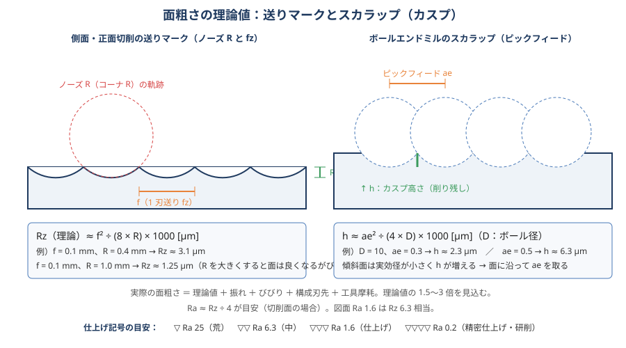

# 10 面粗さ・仕上げ

> **この章のポイント**
> - 理論粗さは **送り f とノーズ R（またはピックフィード ae とボール径 D）** で決まる。式で計算できる。
> - 実際の粗さは理論値の 1.5〜3 倍。振れ・びびり・構成刃先・摩耗が上乗せされる。
> - 仕上げは「取り代を均一に」「専用工具」「高 Vc・小 fz」「ダウンカット」「一定の熱状態」で安定する。

## 1. 面粗さの指標

| 記号 | 意味 | 目安 |
|---|---|---|
| Ra | 算術平均粗さ。最も一般的 | 図面指示の主流 |
| Rz | 最大高さ（山と谷の差、旧 Ry） | Ra ≈ Rz ÷ 4（切削面） |
| Rmax | 旧規格の最大高さ | |
| ▽ | 仕上げ記号：▽ Ra 25、▽▽ Ra 6.3、▽▽▽ Ra 1.6、▽▽▽▽ Ra 0.2 | 旧図面 |

**加工法と到達可能な Ra**

| 加工法 | Ra [µm] |
|---|---|
| フェイスミル荒 | 6.3〜12.5 |
| フェイスミル仕上げ（ワイパー） | 0.8〜3.2 |
| エンドミル側面仕上げ | 0.8〜3.2 |
| ボールエンドミル 3D 仕上げ | 0.4〜3.2（ピック依存） |
| ドリル | 6.3〜12.5 |
| リーマ | 0.8〜3.2 |
| ボーリング | 0.8〜1.6 |
| 研削 | 0.1〜0.8 |
| 高速切削（アルミ、ダイヤ工具） | 0.1〜0.4 |

## 2. 理論粗さ

### 送りマーク（側面・正面切削）

**Rz（理論）≈ f² ÷ (8 × R) × 1000 [µm]**　（f：1 回転送り or 1 刃送り [mm]、R：ノーズ R [mm]）

| f [mm] | R 0.4 | R 0.8 | R 1.0 |
|---|---|---|---|
| 0.05 | 0.8 | 0.4 | 0.3 |
| 0.1 | 3.1 | 1.6 | 1.25 |
| 0.2 | 12.5 | 6.3 | 5.0 |

- 面を良くするには f を下げるか R を上げる。R を大きくすると切削抵抗が増えびびりやすい。
- 多刃カッタでは「1 回転あたりの送り f = fz × z」ではなく、振れがあると **最も出ている 1 刃の 1 回転送り** が面を作る。振れが面粗さを支配する理由。
- ワイパー刃（平らな刃）付きなら f を大きくしても面が出る。

### スカラップ（ボールエンドミル）

**h ≈ ae² ÷ (4 × D) × 1000 [µm]**　（ae：ピックフィード、D：ボール径）

| ae [mm] | D 6 | D 10 | D 20 |
|---|---|---|---|
| 0.2 | 1.7 | 1.0 | 0.5 |
| 0.3 | 3.8 | 2.3 | 1.1 |
| 0.5 | 10.4 | 6.3 | 3.1 |
| 1.0 | 41.7 | 25 | 12.5 |

- 傾斜面では実効径が小さくなり h が増える。CAM の「スキャロップ高さ一定」を使うと面に沿って ae が自動調整される。
- 進行方向の送りマーク（fz）とピック方向のスカラップ（ae）を同程度にすると均一な面になる（fz ≈ ae）。

## 3. 実際の面粗さを悪くする要因と対策

| 要因 | 現れ方 | 対策 |
|---|---|---|
| 工具の振れ | 1 刃だけの深いマーク、周期的縞 | 振れ 5 µm 以下、焼きばめ／ハイドロ |
| びびり | 規則的な模様、光沢のムラ | [07 びびり](07-chatter.md) |
| 構成刃先 | むしれ、光沢なし、鱗状 | Vc↑、鋭い刃、油性クーラント、コート変更 |
| 工具摩耗 | 徐々に悪化、光沢が鈍る、バリ増 | 仕上げ専用工具、早め交換 |
| 切りくずの噛み込み | 引っかき傷 | クーラント・エアで排出、仕上げは最後に |
| 取り代の不均一 | 面の途中で粗さが変わる、段差 | 中仕上げで 0.1〜0.3 均一に残す |
| 進入・退出 | 進入痕、退出のえぐれ | 円弧アプローチ、ワーク外から進入 |
| サーボの追従（コーナ・円弧） | 円弧の多角形化、コーナのだれ | 高精度モード、送り減速、公差設定 |
| 熱 | 途中で寸法・面が変わる | 温度安定後に仕上げ |
| 送り速度のムラ | 縞のピッチが変わる | CAM 公差、先読み、加減速設定 |

## 4. 仕上げ加工の条件と工具

### 側面仕上げ（エンドミル）

- 多刃（4〜6 枚以上）、高 Vc（荒の 1.2〜1.5 倍）、fz 0.03〜0.06、ae 0.1〜0.3 mm、ap は刃長いっぱいで「壁一発」。
- ダウンカット。ゼロカット（同じ経路を 2 回）でたわみと送りマークを軽減。
- コーナ R の小さい工具（R0.2〜0.5）は面が安定し欠けにくい。

### 底面・平面仕上げ

- フェイスミル：ワイパー刃、ae 60〜75%、ap 0.2〜0.5、fz 0.1〜0.2。主軸の直角度が出ていないと「凹」「うろこ」。
- エンドミル底面：ap 0.1〜0.3、ae 60〜70%。底刃の直角性（工具のセンタ側は削らない工具がある）に注意。

### 3D 曲面仕上げ（ボール）

- ボール径はできるだけ大きく（h が小さくなる）。最小 R は別工具でピック。
- ピック ae 0.1〜0.3、fz 0.05〜0.15、Vc は工具の最大周速で計算（傾斜なら実効径で）。
- 傾斜させる（5〜15°）と中心の周速ゼロを避けられる（5 軸・割出し）。
- 等高線（急斜面）＋走査線（緩斜面）の組み合わせ、または一定スキャロップ。
- 高精度・高速モード ON、CAM 公差 0.001〜0.005、スムージング。

### 穴の仕上げ

- リーマ：Vc 5〜15、f 0.2〜0.5、取り代 0.1〜0.3（径）、油性または高濃度クーラント。低速高送りが鉄則。
- ボーリング：ノーズ R 0.2〜0.4、fz 0.05〜0.1、Vc は材料標準。仕上げ代 0.1〜0.3（径）。試し削りで径を追い込む。
- エンドミルの円弧補間：H8〜H9。工具の振れがそのまま真円度に出る。

## 5. バリ対策

バリは「工具が抜け際に材料を押し出す」ことで発生。延性材（アルミ・SS400・SUS）で大きい。

| 対策 | 内容 |
|---|---|
| 抜け際の送り減速 | 貫通穴・端面で送りを 30〜50% に |
| 面取りを先に | 輪郭の面取りを仕上げ前に行うと、仕上げで面取り部にできたバリが取れる |
| 鋭い工具・小さい fz | 押し出しではなく切る |
| ダウンカット | バリが小さい方向 |
| 工具経路の向き | 「ワークの外へ抜ける」より「内側に向かって終わる」 |
| 裏面取り・裏座ぐりカッタ | 貫通穴の裏バリを機上で |
| バリ取り工具（ブラシ、ディスク、フロート式） | 機上バリ取りの自動化 |
| 手作業 | ヤスリ、スクレーパ、面取りカッタ、ブラスト、バレル。固定して、素手厳禁 |

## 6. 面粗さの測定

- 表面粗さ計は **送りマークに直角** に走らせる。カットオフ（λc）は Ra に応じて選ぶ（Ra 0.1〜2 → 0.8 mm、Ra 2〜10 → 2.5 mm）。
- 比較用見本片（粗さ標準片）で指と目で判断する訓練も有効。
- 図面の Ra は「上限」。余裕を持って 7〜8 割の値を狙う。

## 7. 見た目（外観）の品質

- 面粗さが良くても「模様が不均一」「光沢が違う」とクレームになることがある。パスの方向・順序を揃える、送り速度を一定に、工具交換のタイミングを固定。
- 仕上げ面はクーラントの乾き跡・指紋・錆で見栄えが落ちる。加工後は洗浄・防錆・包装まで工程に含める。
