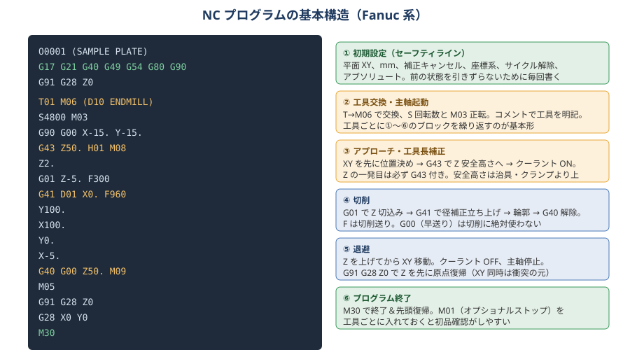
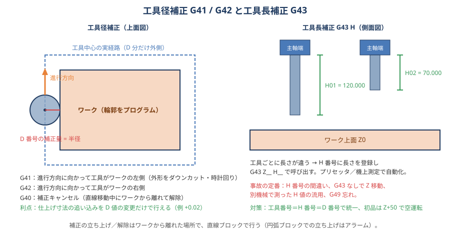
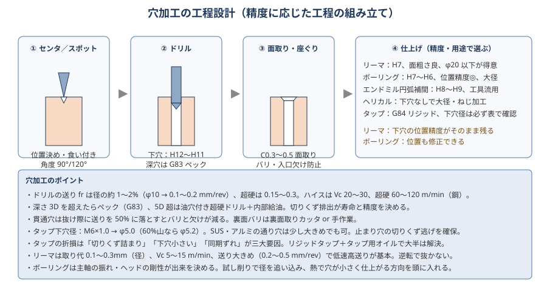
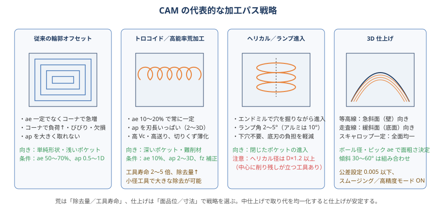

# 11 プログラム（CAM・G コード）

> **この章のポイント**
> - G コードの基本構造は「初期設定 → 工具交換 → アプローチ（G43）→ 切削 → 退避 → 終了」。工具ごとにこの塊を繰り返す。
> - 衝突の原因のほとんどは **補正（G43/H、G41/D）と座標系（G54、G90/G91）の誤り**。プログラムの頭とアプローチを必ず目で確認する。
> - CAM は「荒は負荷一定、仕上げは面と寸法」で戦略を選ぶ。出力後のドライランは省略しない。

## 1. NC プログラムの基本構造



```gcode
O0001 (SAMPLE PLATE)
G17 G21 G40 G49 G54 G80 G90    (初期設定：XY 平面、mm、補正キャンセル、座標系、サイクル解除、絶対)
G91 G28 Z0                     (Z を原点復帰)
T01 M06 (D10 ENDMILL)          (工具交換)
S4800 M03                      (主軸回転)
G90 G00 X-15. Y-15.            (XY 位置決め)
G43 Z50. H01 M08               (工具長補正で安全高さへ、クーラント ON)
Z2.                            (アプローチ高さ)
G01 Z-5. F300                  (切込み)
G41 D01 X0. F960               (径補正立ち上げ)
Y100.
X100.
Y0.
X-5.
G40 G00 Z50. M09               (補正キャンセル・退避)
M05
G91 G28 Z0                     (Z を先に原点復帰)
G28 X0 Y0
M30
```

## 2. よく使う G コード・M コード（Fanuc 系）

### 準備機能（G）

| コード | 機能 | 注意 |
|---|---|---|
| G00 | 位置決め（早送り） | 切削に使わない。直線補間ではない（軸ごとに動く） |
| G01 | 直線補間 | F 必須 |
| G02 / G03 | 円弧補間（時計／反時計） | I, J（中心の相対位置）または R。180° 超は R をマイナス |
| G04 | ドウェル（一時停止） | P（ms）または X（秒） |
| G17 / G18 / G19 | 平面選択（XY / ZX / YZ） | 円弧・径補正・サイクルに影響 |
| G20 / G21 | インチ／mm | 冒頭で G21 |
| G28 | 原点復帰（中間点経由） | G91 G28 Z0 で Z のみ。G90 のまま G28 Z0 は「Z0 を経由」して危険 |
| G40 / G41 / G42 | 径補正キャンセル／左／右 | 直線ブロックで立ち上げ・解除 |
| G43 / G44 / G49 | 長補正 + / − / キャンセル | G43 + H 番号。工具ごとに必ず |
| G52 | ローカル座標系 | 使用後 G52 X0 Y0 Z0 で戻す |
| G53 | 機械座標系での移動 | 1 ブロック限り。工具交換位置などに |
| G54〜G59 | ワーク座標系 | |
| G68 / G69 | 座標回転／キャンセル | 傾いた段取り、多数個取り |
| G73〜G89 | 固定サイクル（穴） | G80 でキャンセル |
| G90 / G91 | 絶対／増分 | 混在時の事故に注意 |
| G94 / G95 | 毎分送り／毎回転送り | MC は G94 が標準 |
| G98 / G99 | サイクル戻り点：イニシャル点／R 点 | クランプ・段差を越えるときは G98 |

### 補助機能（M）

| コード | 機能 |
|---|---|
| M00 / M01 | プログラム停止／オプショナルストップ |
| M03 / M04 / M05 | 主軸正転／逆転／停止 |
| M06 | 工具交換 |
| M08 / M09 | クーラント ON / OFF（M07 ミスト、M50 台スルー等は機種依存） |
| M19 | 主軸オリエンテーション |
| M29 | リジッドタップモード（Fanuc） |
| M30 / M02 | プログラム終了（M30 は先頭復帰） |
| M98 / M99 | サブプログラム呼出し／終了 |

## 3. 補正



### 工具長補正（G43 H）

- 工具ごとに長さが違う → H 番号に長さ（またはワーク上面からの差）を登録し、G43 Z__ H__ で呼び出す。
- **Z の最初の移動は必ず G43 付き**。G43 なしで Z を下げると衝突する。
- 「工具番号 = H 番号 = D 番号」で統一するとミスが激減する。
- 測定方法（プリセッタ基準／機上ツールセッタ／ワーク上面タッチ）で H の意味が変わる。機械ごとに統一。

### 工具径補正（G41 / G42 D）

- 輪郭をそのままプログラムし、工具半径分のオフセットを NC が計算する。
- G41：進行方向に向かって左（外形をダウンカットで時計回り）、G42：右。
- 立ち上げ・解除は **ワークから離れた場所で直線ブロック** で行う（円弧ブロックはアラーム）。
- 補正量より小さい円弧・段差があると「補正干渉」アラーム。
- 仕上げ寸法の追い込みは D 値の変更だけで済む（例：0.02 大きい → D を +0.01）。
- CAM は「工具中心経路」を出すのが一般的（径補正なし）。追い込みたい場合は「摩耗補正（wear）」モードで出力すると G41 + D（差分）で調整できる。

## 4. 固定サイクル（穴加工）



| コード | 用途 | 書式例 |
|---|---|---|
| G81 | ドリル（浅穴） | G81 X_ Y_ Z-10. R2. F200 |
| G82 | 座ぐり（底でドウェル） | G82 Z-5. R2. P500 F150 |
| G83 | ペックドリル（深穴、切りくず排出） | G83 Z-40. R2. Q3. F200 |
| G73 | 高速ペック（少し戻る） | G73 Z-30. R2. Q3. F250 |
| G84 | タップ（リジッドは M29 S_ の後） | M29 S500 → G84 Z-15. R5. F750（F = ピッチ × S） |
| G74 | 逆タップ（左ねじ） | |
| G85 | リーマ／ボーリング（送りで戻る） | G85 Z-20. R2. F100 |
| G86 | ボーリング（主軸停止・早送り戻り） | |
| G76 | ファインボーリング（シフトして戻る） | G76 Z-20. R2. Q0.5 F80 |
| G80 | サイクルキャンセル | 必ず入れる |

**ポイント**

- R 点はワーク面から 2〜5 mm 上。クランプを越える移動は G98（イニシャル点戻り）。
- G83 の Q（1 回の切込み）は径の 1〜3 倍。油穴付きならノンステップ可。
- リジッドタップは主軸と送りが同期するため、フローティングタッパ不要。F はピッチ × 回転数で厳密に。
- 傾斜面・曲面への穴は、まずフラットドリル／エンドミルで座を作る。

## 5. サブプログラムとマクロ

- **サブプログラム（M98 P_ L_）**：同じ穴パターン・同じ輪郭の繰り返し。多数個取りは G54〜G59 or G52 で座標をずらして呼ぶ。
- **カスタムマクロ（#変数、IF、WHILE、GOTO）**：条件分岐や計算を伴う繰り返し。タッチプローブでの計測・自動補正（G65 P9810 など、機種のマクロ）。
- **パラメトリック**：寸法違いの類似品を変数で。

## 6. 高速・高精度制御

- **先読み（ルックアヘッド）**：微小ブロックの連続（3D 面）で送りが落ちないように。G05 P10000、G05.1 Q1、G08 P1 など機種依存。
- **公差設定**：CAM のトレランス（0.001〜0.01）と NC 側の許容誤差を合わせる。粗いと多角形化、細かすぎるとデータ量と減速。
- **コーナ減速**：コーナのだれ／オーバーシュートを制御。仕上げ面の要求に応じてモード切替。
- **スムージング／ナノ補間**：ブロック間を滑らかに。

## 7. CAM の加工パス戦略



| 戦略 | 用途 | 条件の考え方 |
|---|---|---|
| 輪郭オフセット（従来のポケット） | 浅い単純ポケット | ae 50〜70%、ap 0.5〜1D。コーナで負荷急増に注意 |
| トロコイド／高能率（Adaptive、Dynamic、iMachining 等） | 深いポケット、難削材、小径工具 | ae 5〜15%、ap 2〜3D、fz 薄化補正、高 Vc |
| 高送り荒加工 | 大量除去、剛性が低い機械 | ap 0.5〜2、fz 0.5〜2 |
| プランジ（突き加工） | 深いポケット、長い突き出し | Z 方向の剛性を活かす |
| 等高線（Z レベル） | 急斜面、壁 | 仕上げは一定ステップ、荒は取り残し除去 |
| 走査線（スキャン、ラスター） | 緩斜面、底面 | ピック一定 |
| スキャロップ一定 | 曲面全体を均一に | h から ae を自動計算 |
| ペンシル／残し加工 | コーナの削り残し | 小径工具で最後に |
| ヘリカル／ランプ進入 | 閉じたポケットへの進入 | ランプ角 2〜5°、ヘリカル径 D×1.2 以上 |
| 円弧アプローチ／リトラクト | 仕上げ面への進入痕防止 | 接線方向から |

### CAM 設定のチェックポイント

- 素材モデルと実際の素材寸法（取り代）が合っているか。
- 工具モデルにホルダ・突き出しを設定し、ホルダ干渉チェックを ON。
- 安全高さ・クリアランス高さがクランプ・治具より上か。
- 荒→中仕上げ→仕上げで「残し代」が正しく引き継がれているか（残し代 0 で仕上げにかかると工具が死ぬ）。
- ダウンカット（Climb）が既定になっているか。
- コーナで減速／円弧化（コーナ R を工具径の 1.1〜1.2 倍以上に）。
- シミュレーション（削り残し・食い込み・干渉）を必ず流す。

## 8. ポストプロセッサ

- 機械・NC・オプション（高精度モード、リジッドタップ、G05）に合わせて調整する。
- 出力後の G コードは、**頭のセーフティライン、工具交換ブロック、G43 のあるアプローチ、終了処理** を目で確認する。
- ポストの改造は履歴を残し、テストプログラムで検証してから本番へ。

## 9. ドライラン・初品の手順

1. 機械に転送後、プログラムチェック（グラフィック表示）で経路を目視。
2. **Z を +50 mm**（G54 の Z を一時的に +50 するか、機械のオフセット）してドライラン。または送りオーバーライド 25% でシングルブロック。
3. 工具交換位置、アプローチ、退避高さ、クランプとの干渉を確認。
4. Z を戻して初品加工。工具ごとに M01 で止めて確認。
5. 仕上げ前に中間測定 → 補正 → 仕上げ。

## 10. 衝突の定番と防止

| 定番 | 防止策 |
|---|---|
| G43 なしで Z 移動 | ポストで必ず出力、目視確認 |
| H 番号違い（前の工具の H が残る） | T = H = D 統一、G49 を工具交換前に |
| G90/G91 の混在 | 冒頭で G90、G28 は G91 とセットで |
| G54 と G55 の取り違え | コメントで明記、段取り時にクリア |
| ワーク座標の符号ミス | 入力後に MDI で移動して確認 |
| 早送りで Z と XY 同時移動（斜めに突っ込む） | 退避は Z を先に、アプローチは XY → Z の順 |
| サイクルの R 点がクランプより低い | G98、R 点の再確認 |
| 工具長の測定ミス（別機械の値を流用） | 機械ごとに測定、自動計測 |
| オーバーライドを 100% に戻し忘れ／戻し過ぎ | 初品は 25〜50% で最後まで |
| プログラムの編集ミス（一部だけ修正） | 編集後は必ず先頭から再チェック |

## 11. プログラム管理

- ファイル名・O 番号・図面番号・改訂を紐付ける。
- 「加工に使った版」を凍結し、編集は別名で。
- 機械内のプログラムを定期的に PC へバックアップ。
- 条件（S・F）を変えたら CAM 側にも反映（機械側だけ変えると次回に戻る）。
