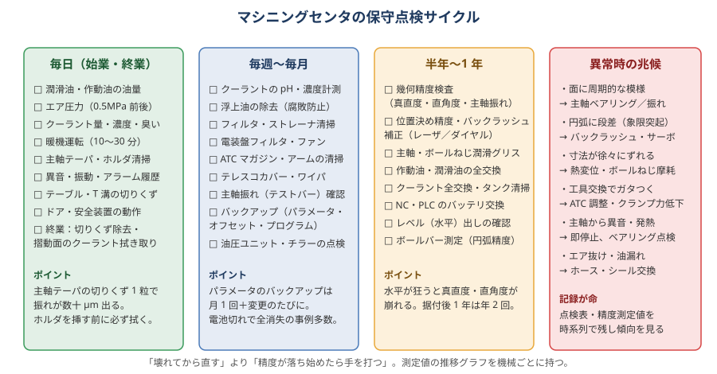

# 12 機械の保守・精度管理

> **この章のポイント**
> - 「壊れてから直す」ではなく「精度が落ち始めたら手を打つ」。測定値を時系列で記録して傾向を見る。
> - 毎日の暖機と清掃（主軸テーパ・基準面）が、精度の 8 割を守る。
> - パラメータ・オフセット・プログラムのバックアップは「月 1 回＋変更のたび」。バッテリ切れで全消失する事例は珍しくない。

## 1. 日常点検（始業・終業）

### 始業

- [ ] 潤滑油（摺動面・ボールねじ）と作動油の油量、油圧の圧力
- [ ] エア圧力（0.5 MPa 前後）、ドレン抜き、エアフィルタ
- [ ] クーラントの量・濃度・臭い・浮上油
- [ ] 暖機運転（主軸 10〜30 分＋各軸ストローク往復。暖機プログラムを用意）
- [ ] 主軸テーパ・ホルダテーパの清掃（エアブロー＋ウエス）
- [ ] 異音・振動・アラーム履歴の確認
- [ ] ドアインターロック・非常停止・安全装置の動作
- [ ] テーブル・T 溝・基準面の切りくず

### 終業

- [ ] 切りくずの除去（テーブル、テレスコカバー、チップコンベア）
- [ ] 摺動面・テーブルのクーラント拭き取り（水溶性は放置すると錆と乾燥残渣）
- [ ] 主軸を上げ、テーブルを中央に（カバーへの負担を減らす）
- [ ] 主電源を切る前に NC の正常終了
- [ ] 気になった異常のメモ（翌日の作業者・保全担当へ）

## 2. 定期点検（週〜月）

- クーラント：濃度（屈折計）、pH、浮上油の除去、フィルタ・ストレーナ清掃
- 電装盤：フィルタ・ファンの清掃（過熱でアラーム・故障）
- ATC：マガジン・アーム・ポットの清掃、工具クランプ力（引っ張り試験器）
- テレスコカバー・ワイパの破損（切りくずが案内面に入る）
- 主軸振れの確認（テストバー）
- 潤滑ポンプの吐出確認、油の汚れ
- **バックアップ**：パラメータ、オフセット（工具・ワーク）、マクロ変数、PLC ラダー、プログラム
- チラー（主軸冷却）のフィルタ・冷媒温度

## 3. 定期点検（半年〜年）

- 幾何精度検査（真直度、直角度、主軸振れ、テーブル面の平面度）
- 位置決め精度・繰り返し精度（レーザ測長器）→ ピッチ誤差補正・バックラッシュ補正の更新
- ボールバー測定（円弧精度、直角度、バックラッシュ、サーボゲイン）
- 水平（レベル）の確認と調整（据付後 1 年間は年 2 回、以後年 1 回）
- 潤滑油・作動油の全交換、主軸・ボールねじのグリス
- クーラント全交換とタンク清掃
- NC・サーボアンプ・PLC のバッテリ交換（**期限前に**）
- ケーブル・ホースの損傷、油漏れ、エア漏れ

## 4. 精度検査の方法（自社でできる範囲）

| 項目 | 方法 | 判定の目安 |
|---|---|---|
| 主軸振れ | テストバーを主軸に付け、ダイヤルで先端と根元を測る | 根元 0.005 以下、300 mm 先端 0.015 以下 |
| 主軸のテーブルに対する直角度 | 主軸にダイヤルを付け、テーブル上で半径 150〜300 mm の円を描いて読む | 0.01〜0.02/300 |
| テーブルの真直度 | 直定規（ストレートエッジ）をテーブルに置き、主軸側のダイヤルで X 方向に走らせる | 0.01/300 |
| 直角度 X-Y | 直角マスタ（スコヤ）を X に合わせ、Y 方向にダイヤルを走らせる | 0.01/300 |
| バックラッシュ | ダイヤルをブロックに当て、+ 方向から止め、− に 0.01 動かして戻り量を読む | 0.005 以下。大きければ NC のバックラッシュ補正 |
| 位置決め精度 | ブロックゲージ／レーザ測長器で 100 mm ごとに測定 | ±0.01/全長 |
| 円弧精度 | ボールバー、または試し削りした円をマイクロメータ・真円度計で | 0.01 以下 |
| ATC 繰り返し精度 | 同じ工具を数回交換して振れ・長さを測る | 振れ差 0.005 以下 |

**記録の残し方**：機械ごとに「精度管理シート」を作り、測定日・値・環境温度・担当者を残す。グラフにすると劣化の傾向が見える。

## 5. 熱対策と設置環境

- 直射日光、出入口の風、暖房・冷房の直風を避ける。
- 床の振動（プレス・大型機の近く）は精度に出る。防振基礎。
- 恒温室（20 ± 1 ℃）は精密加工の前提。恒温でなくても「温度変化を小さく・ゆっくり」にする（断熱、扉の開閉ルール）。
- 主軸冷却（チラー）の設定温度を室温に追従させる（一定温度固定は季節で狂う）。
- 熱変位補正（主軸・ボールねじ）の機能を有効化し、効果を確認。

## 6. 主要部品の寿命と兆候

| 部品 | 寿命の目安 | 劣化の兆候 |
|---|---|---|
| 主軸ベアリング | 10,000〜20,000 時間（条件による） | 異音、発熱、振れ増加、面に周期模様 |
| ボールねじ | 10,000〜20,000 時間 | バックラッシュ増、位置決めばらつき、異音 |
| 直動ガイド | 摩耗・損傷は潤滑で大きく変わる | ガタ、異音、真直度悪化 |
| テレスコカバー | 3〜5 年 | 破れ、引っかかり |
| NC バッテリ | 1〜2 年（メーカー指定） | バッテリ警告アラーム。**警告が出たら 1 週間以内に交換** |
| クーラントポンプ | 5〜10 年 | 吐出低下、異音 |
| ATC アーム・ポット | 使用回数による | 工具の位置ずれ、落下 |
| 油圧・空圧シリンダのシール | 3〜5 年 | 油漏れ、エア漏れ、クランプ力低下 |

## 7. 異常時の初動

| 症状 | まず確認 | 次に |
|---|---|---|
| 面に周期的な模様 | 工具振れ、主軸ベアリング | 主軸の振動測定、メーカー診断 |
| 円弧に段差（象限突起） | バックラッシュ補正、ボールバー | サーボパラメータ調整（メーカー） |
| 寸法が徐々にずれる | 熱変位、暖機、室温 | ボールねじ摩耗、スケール汚れ |
| 位置決めが再現しない | 潤滑、ガイドのガタ、切りくず噛み | サーボ、ボールねじ |
| 工具交換でガタつく／落下 | ATC 調整、クランプ力、テーパの汚れ | ドローバー・皿ばね交換 |
| 主軸から異音・発熱 | **即停止** | ベアリング点検、潤滑、メーカー |
| エア圧低下 | コンプレッサ、ドレン、漏れ | 配管・シール |
| アラーム頻発 | アラーム番号と履歴 | 取説、メーカー |
| 油漏れ・クーラント漏れ | 発生箇所の特定、床の清掃（滑り防止） | シール・ホース交換 |

## 8. バックアップと復旧

- バックアップ対象：**パラメータ（最重要）**、ピッチ誤差補正、工具オフセット、ワークオフセット、マクロ変数、PLC（ラダー）、プログラム、ATC の工具配置表。
- 保存先：PC＋外部媒体。日付付きで世代管理。
- 復旧手順を書いた紙を制御盤に貼っておく（担当者不在でも復旧できるように）。

## 9. 保守記録のフォーマット例

| 日付 | 機械 | 項目 | 測定値／内容 | 環境温度 | 担当 | 次回予定 |
|---|---|---|---|---|---|---|
| 2026-04-01 | MC-1 | 主軸振れ（300mm） | 0.008 | 22 ℃ | 山田 | 2026-10 |
| 2026-04-01 | MC-1 | バックラッシュ X/Y/Z | 0.002/0.003/0.001 | 22 ℃ | 山田 | 2026-10 |
| 2026-04-15 | MC-1 | クーラント全交換 | 濃度 7% | | 佐藤 | 2026-10 |
| 2026-05-10 | MC-1 | NC バッテリ交換 | | | 佐藤 | 2027-05 |
