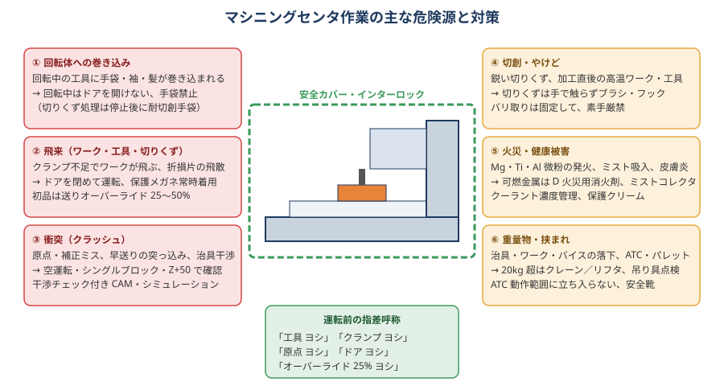

# 13 安全

> **この章のポイント**
> - マシニングセンタの災害は「巻き込み」「飛来」「衝突」「切創・やけど」「火災」「重量物」に分類できる。それぞれに決まった予防策がある。
> - **ドアを閉める・手袋をしない・初品はオーバーライドを絞る**。この 3 つは例外なし。
> - 安全は個人の注意力ではなく、ルールと設備（インターロック、カバー、集塵）で守る。

## 1. 危険源と対策

### ① 回転体への巻き込み

- 主軸回転中の工具・ワークに手袋・袖・髪・ウエスが巻き込まれる。**手袋をしたまま回転体に近づかない**（切りくず処理は停止後に耐切創手袋）。
- 長髪は帽子にまとめる、袖口・裾は締める、ネックストラップ・アクセサリは外す。
- 回転中はドアを開けない。ドアインターロックを無効化しない。
- 主軸に手を出す前に「主軸停止・回転停止表示」を確認（惰性回転に注意）。

### ② 飛来（ワーク・工具・切りくず）

- クランプ不足でワークが飛ぶ、工具折損片が飛散する。**ドアを閉めて運転**、保護メガネ常時着用。
- 初品・条件変更時は送りオーバーライド 25〜50% で様子を見る。
- くわえ代 5 mm 以上、クランプは切削力の向きを考える（→ [05 段取り](05-setup-fixture.md)）。
- ドアの窓（ポリカーボネート）は経年で強度が落ちる。傷・白濁があれば交換。

### ③ 衝突（クラッシュ）

- 原点・補正ミス、早送りでの突っ込み、治具・クランプとの干渉。
- 空運転（Z+50、シングルブロック、オーバーライド 25%）を省略しない。
- 干渉チェック付き CAM、機械シミュレーション。
- 衝突後は「動くから大丈夫」ではなく、主軸振れ・各軸精度を確認してから再開。

### ④ 切創・やけど

- 切りくずは鋭く、加工直後は高温。手で触らずブラシ・フック・エアで処理（エアは飛散に注意、保護メガネ）。
- バリ取りは固定して行い、素手で面を撫でない。
- 工具の刃先はワイパー・保護キャップで扱う。落とした工具を反射的に受けない。

### ⑤ 火災・健康被害

- Mg・Ti・Al の微粉は発火する。乾燥した細かい切りくずを溜めない、専用消火剤（D 火災）を用意、水をかけない（Mg）。
- 油性クーラントの引火、ドライ加工の高温切りくず。無人運転は火災検知・自動消火を検討。
- ミスト・粉じんの吸入（ミストコレクタ、集塵機、換気）、クーラントの皮膚炎（濃度管理、保護クリーム、手洗い）。
- ベリリウム銅・鉛入り快削材・樹脂粉じんは有害。SDS（安全データシート）を確認。

### ⑥ 重量物・挟まれ

- 20 kg 超はクレーン／リフタ。吊り具の定格・点検、玉掛け資格。
- 治具・バイス・ワークの落下（足、手）。安全靴。
- ATC・パレットチェンジャの動作範囲に立ち入らない。
- テーブル移動時の挟まれ（治具とカバーの間）。

### ⑦ 感電・その他

- 制御盤は資格者以外開けない。清掃時も主電源 OFF。
- 床の油・クーラントは即拭く（転倒）。
- 圧縮エアで体・服を吹かない。

## 2. 作業ルール

### 運転前

- [ ] 保護メガネ・安全靴・帽子。手袋なし（切りくず処理時のみ耐切創）。
- [ ] 工具・ホルダの固定、振れ確認。
- [ ] ワークのクランプ、浮きなし、切削方向に対する当て。
- [ ] 原点（G54）・工具長（H）を MDI で確認。
- [ ] 空運転済み。
- [ ] ドア閉、クーラントノズル向き、周囲の人・物。
- [ ] **指差呼称**：「工具ヨシ」「クランプヨシ」「原点ヨシ」「ドアヨシ」「オーバーライド 25% ヨシ」

### 運転中

- 初品はプログラムの最後まで機械の前にいる。
- 異音・異臭・振動・煙 → 即座に送りホールド → 主軸停止 → 原因確認。
- 非常停止ボタンの位置を体で覚える。
- 加工中にドアを開ける必要がある操作（切りくず除去等）は、必ず M00 で止めてから。

### 運転後

- 主軸停止・回転停止を確認してからドアを開ける。
- 切りくず処理は工具・ワークから手を離して、道具で。
- ワークの取り外しは、熱いことを前提に。

### 教育・体制

- 新人は「単独運転許可」の基準を決め、それまでは有資格者の指導下で。
- ヒヤリハットを記録・共有。責めない。
- 安全装置の無効化（インターロックのバイパス）は懲戒事項にする。
- 5S（整理・整頓・清掃・清潔・躾）：床の油、通路の材料、散らかった工具は災害の温床。

## 3. 非常時の対応

| 事象 | 対応 |
|---|---|
| 衝突 | 非常停止 → 主電源はそのまま（サーボ OFF で落下する軸がある機種も。取説確認）→ 状況記録（写真）→ 工具・ワーク撤去 → 精度確認 → 再開 |
| 工具折損 | 送りホールド → 主軸停止 → 破片の回収（保護メガネ・手袋）→ 原因（条件・寿命・切りくず） |
| ワーク飛び出し | 非常停止 → 人の安全確認 → ドア・カバーの損傷確認 → クランプの見直し |
| 火災 | 非常停止・主電源 OFF → 消火器（金属火災は専用）→ 通報 → 避難 |
| 負傷 | 応急処置（切創：圧迫止血、やけど：冷却）→ 医療機関 → 報告 |
| 停電 | 復電後は原点復帰から。プログラム途中再開は位置を必ず確認 |

## 4. 法令・規格（日本）

- 労働安全衛生法・同規則：機械の安全装置、作業主任者、特別教育（クレーン、玉掛け、粉じん等）。
- 機械安全（JIS B 9700／ISO 12100、JIS B 6014 など）：機械側の設計。
- 化学物質のリスクアセスメント（クーラント、洗浄剤の SDS）。
- 産業廃棄物（廃液、切りくず、廃工具）の処理。

## 5. 無人運転の安全

- 工具折損検知、主軸負荷監視、寿命管理による自動交換。
- 切りくず堆積（チップコンベア）、クーラント液量、ミストコレクタ。
- 火災検知・自動消火（油性・Mg・Ti）。
- 異常時に安全側で停止する設定（アラームで主軸・送り停止、ドアロック維持）。
- 遠隔監視（通知）と、駆けつけ手順。
